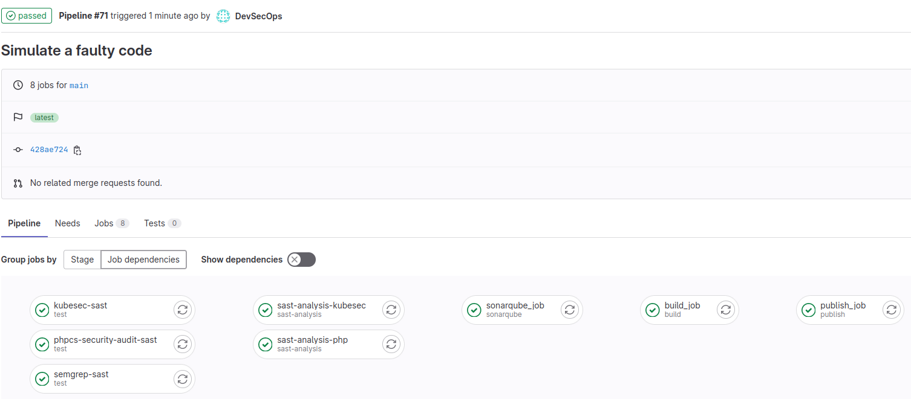
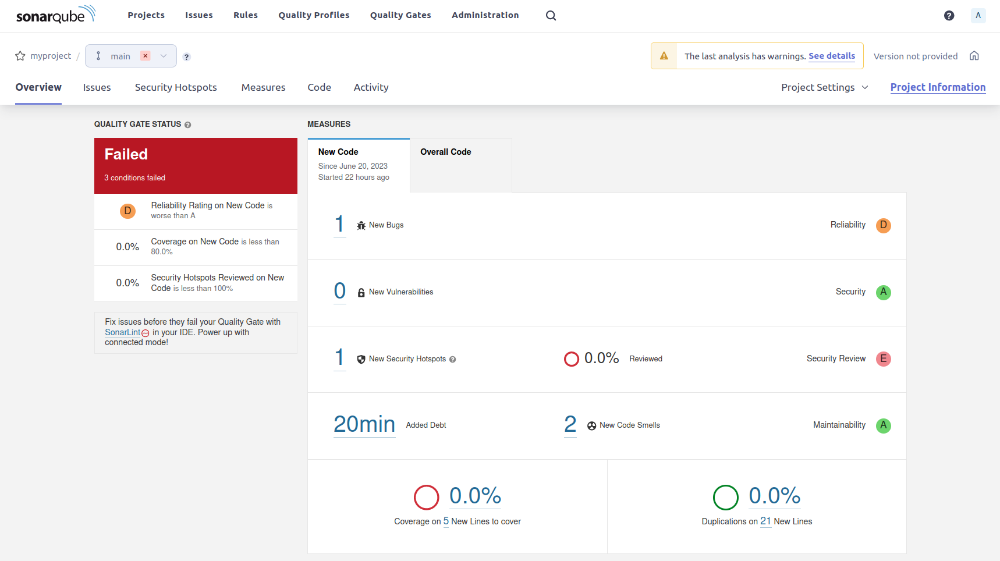

# Lab | Block the DevSecOps pipeline in case of problems

In this lab you will complete the DevSecOps GitLab CI pipeline by making the
SonarQube step affecting the promotion of the code.

## Simulate faulty source code

Let's push a faulty source code to our repo:

```java
package org.example;

public class Example {
    public static void main(String[] args) {
        int x = 5;
        int y = 0;
        int result = x / y; // Division by zero error
        int result = x / y; // Division by zero error
        int result = x / y; // Division by zero error
        int result = x / y; // Division by zero error
        int result = x / y; // Division by zero error
        int result = x / y; // Division by zero error
        int result = x / y; // Division by zero error
        int result = x / y; // Division by zero error
        int result = x / y; // Division by zero error
        int result = x / y; // Division by zero error
        logger.log("Result: " + result);
    }
}
```

In this example, the code attempts multiple times to divide the variable `x`
by `y`, which is initialized to 0. This division by zero operation will
result in an exception at runtime, causing the program to crash or behave
unexpectedly and the code repetition is obviously wrong.

SonarQube can identify the issues and raise a warning or error, indicating a
potential bug or vulnerability in the code.

SonarQube is designed to analyze source code for various issues such as bugs,
code smells, security vulnerabilities, and maintainability problems.
It applies a set of predefined rules and checks to identify potential issues
and provide feedback to developers, enabling them to improve the quality of
their code.

Let's push it on the repo:

```console
$ mkdir -vp src/org/example
mkdir: created directory 'src'
mkdir: created directory 'src/org'
mkdir: created directory 'src/org/example'

$ cat <<EOF > src/org/example/Example.java
package org.example;

public class Example {
    public static void main(String[] args) {
        int x = 5;
        int y = 0;
        int result = x / y; // Division by zero error
        int result = x / y; // Division by zero error
        int result = x / y; // Division by zero error
        int result = x / y; // Division by zero error
        int result = x / y; // Division by zero error
        int result = x / y; // Division by zero error
        int result = x / y; // Division by zero error
        int result = x / y; // Division by zero error
        int result = x / y; // Division by zero error
        int result = x / y; // Division by zero error

        logger.log("Result: " + result);
    }
}
EOF

$ git add . && git commit -m "Simulate a faulty code"
[main 81a9f2c6f04b] Simulate a faulty code
 1 file changed, 9 insertions(+)
 create mode 100644 src/org/example/Example.java

$ git push
Enumerating objects: 7, done.
Counting objects: 100% (7/7), done.
Delta compression using up to 8 threads
Compressing objects: 100% (3/3), done.
Writing objects: 100% (6/6), 562 bytes | 562.00 KiB/s, done.
Total 6 (delta 1), reused 0 (delta 0), pack-reused 0
To ssh://172.16.99.1:2222/devsecops/myproject.git
   113b719..3bb171d  main -> main
```

## Check pipeline status

First thing to note, if the [DevSecOps-Pipeline-GitLab-SAST.md](DevSecOps-Pipeline-GitLab-SAST.md)
was correctly completed, the pipeline will be automatically integrated with
the `semgrep-sast` test stage, which means that GitLab discovered the `.java`
file and processed it with the ideal tester:



Second thing to note is that, unexpectedly, the pipeline will complete with
no errors. The SonarQube stage completes as follows:

```console
...
INFO: ------------------------------------------------------------------------
INFO: EXECUTION SUCCESS
INFO: ------------------------------------------------------------------------
INFO: Total time: 5.942s
INFO: Final Memory: 22M/114M
INFO: ------------------------------------------------------------------------
Job succeeded
```

But by looking into the project details we will find a Failed status:



This happens because we don't have a blocker for the pipeline.

## Configure the quality gate

It is possible to make `sonar-scanner` use the quality gate functionality,
that will ensure that the correct result is returned from SonarQube before
moving on.

This can be implemented by changing the `sonarqube_job` stage, adding the
`sonar.qualitygate.wait=true` option into the `.gitlab-ci.yml` file:

```yaml
sonarqube_job:
  stage: sonarqube
  image: sonarsource/sonar-scanner-cli:latest
  script:
    - sonar-scanner
      -Dsonar.host.url=${SONAR_HOST_URL}
      -Dsonar.token=${SONAR_TOKEN}
      -Dsonar.projectKey=myproject
      -Dsonar.qualitygate.wait=true
  only:
    - main
```

By pushing the change:

```console
$ git add .gitlab-ci.yml && git commit -m "Add quality gate"
[main 12af23884239] Add quality gate
 1 file changed, 1 insertion(+)

$ git push
Enumerating objects: 5, done.
Counting objects: 100% (5/5), done.
Delta compression using up to 8 threads
Compressing objects: 100% (3/3), done.
Writing objects: 100% (3/3), 322 bytes | 322.00 KiB/s, done.
Total 3 (delta 2), reused 0 (delta 0), pack-reused 0
To ssh://172.16.99.1:2222/devsecops/myproject.git
   3bb171d..d582dcf  main -> main
```

A new pipeline will be started, and this should fail with a message like
this:

```console
INFO: Analysis report uploaded in 13ms
INFO: ------------- Check Quality Gate status
INFO: Waiting for the analysis report to be processed (max 300s)
INFO: ------------------------------------------------------------------------
INFO: EXECUTION FAILURE
INFO: ------------------------------------------------------------------------
INFO: Total time: 10.559s
INFO: Final Memory: 21M/114M
INFO: ------------------------------------------------------------------------
ERROR: Error during SonarScanner execution
ERROR: QUALITY GATE STATUS: FAILED - View details on http://172.16.99.1:9000/dashboard?id=myproject
ERROR:
ERROR: Re-run SonarScanner using the -X switch to enable full debug logging.
ERROR: Job failed: exit code 1
```

## Fix the code

To close the activity, let's fix our code, by removing the problems. The new
code should be something like this:

```java
package org.example;

public class Example {
    public static void main(String[] args) {
        int x = 5;
        int y = 1;
        int result = x / y;

        logger.log("Result: " + result);
    }
}
```

By pushing it, we can see if the quality gate gets fixed:

```console
$ git add . && git commit -m "Fix faulty code"
[main 146483ea9a74] Fix faulty code
 1 file changed, 2 insertions(+), 2 deletions(-)

$ git push
Enumerating objects: 11, done.
Counting objects: 100% (11/11), done.
Delta compression using up to 8 threads
Compressing objects: 100% (3/3), done.
Writing objects: 100% (6/6), 426 bytes | 426.00 KiB/s, done.
Total 6 (delta 2), reused 0 (delta 0), pack-reused 0
To ssh://172.16.99.1:2222/devsecops/myproject.git
   d582dcf..00f0947  main -> main
```

The original error is not there anymore, and the pipeline should now be
green.

### Code coverage

If Sonarqube fails again, check the quality gates, and create a custom quality
gate associated to the project that will have `Conditions on New Code` ->
`Coverage` set to zero.

Another viable solution would be to implement a unit test related to the example
Java file, this is beyond the scope of this exercise, but is considered a best
practice by Sonarqube.
