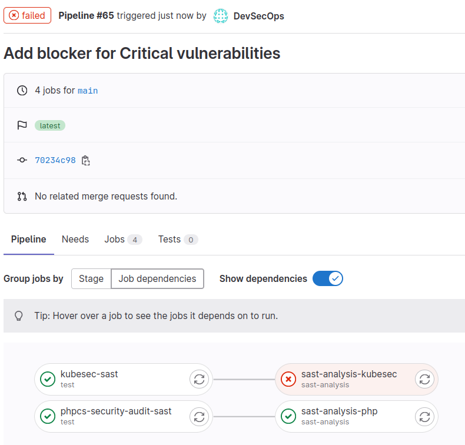

# Lab | Configure GitLab on an example git repository

1. We will need some code inside `myproject` to check GitLab's SAST
   functionalities, so we will create two kind of sources.

   A faulty Kubernetes Pod manifest:

   ```console
   > pwd
   /home/kirater/myproject

   > mkdir manifests

   > cat <<EOF > manifests/Pod.yml
   apiVersion: v1
   kind: Pod
   metadata:
     name: kubesec-demo
   spec:
     containers:
     - name: kubesec-demo
       image: gcr.io/google-samples/node-hello:1.0
       securityContext:
         allowPrivilegeEscalation: true
   EOF
   ```

   A faulty php source code:

   ```console
   > mkdir php

   > cat <<EOF > php/faulty.php
   <?php
   // This code contains a security vulnerability

   // Extract user input from GET parameters
   \$id = \$_GET['id'];

   // SQL query without proper input validation
   \$query = "SELECT * FROM users WHERE id = \$id";

   // Execute the SQL query
   \$result = mysqli_query(\$connection, \$query);

   // Fetch the data
   \$data = mysqli_fetch_assoc($result);

   // Display the user's details
   echo "Username: " . \$data['username'] . "<br>";
   echo "Email: " . \$data['email'] . "<br>";
   EOF
   ```

2. To activate a GitLab CI and use GitLab's SAST functionalities it is
   sufficient to create a file named `.gitlab-ci.yml` inside the root directory
   of your project with these contents:

   ```console
   > cat <<EOF > .gitlab-ci.yml
   include:
     - template: Jobs/SAST.gitlab-ci.yml

   variables:
     SECURE_LOG_LEVEL: "debug"
     SCAN_KUBERNETES_MANIFESTS: "true"

   stages:
     - test

   sast:
     stage: test
     artifacts:
       paths:
         - gl-sast-report.json
   EOF
   ```

   This will activate the pre-built SAST template in GitLab `Jobs/SAST.gitlab-ci.yml`
   and launch all the tests for the files, using a debug log level and scanning
   also Kubernetes manifests (by default disabled).

   Eventually the scan results will be stored in a file named `gl-sast-report.json`.

   To make everything running, it will be enough to create a commit with all the
   newly created files:

   ```console
   > git add . && git commit -m "Activate CI"
   [main 91d522538048] Activate CI
    3 files changed, 43 insertions(+)
    create mode 100644 .gitlab-ci.yml
    create mode 100644 manifests/Pod.yml
    create mode 100644 php/faulty.php

   > git push
   ```

3. Inside the GitLab web interface, in short, under the CI/CD section of
   `myproject` it will be possible to select `Pipelines` and look at the status:

   

   And after some time everything should be green:

   

   Which it seems good, apart from the fact that we introduced faulty code for
   both php sources and Kubernetes manifests, and by looking at the details of
   the pipelines we should see something like this:

   

   And the same applies for PHP, but with no `Critical` vulnerabilities.
   So, if we want to make this worthy, we need to instruct our pipeline to stop
   if it finds `Critical` vulnerabilites.

4. Each job launched in the `test` stage produces a `gl-sast-report.json` json
   artifact containing the results of each scan.
   There are multiple ways to analyze this file and take actions, one is to add
   a new stage named i.e. `sast-analysis` in which we will use a `jq` query to
   extract the vulnerabilities based upon their severity:

   ```yaml
   stages:
     - test
     - sast-analysis
   ```

   We will first define a varible named `BLOCKING_VULNERABILITY_SEVERITY` that
   will be set to the defined severity, in this case `Critical`:

   ```yaml
   variables:
     ...
     BLOCKING_VULNERABILITY_SEVERITY: "Critical"
   ```

   Then for each of the analysis we want to check we will define a related and
   connected job.

   For php:

   ```yaml
   sast-analysis-php:
     stage: sast-analysis
     image: registry.gitlab.com/gitlab-ci-utils/curl-jq
     needs:
       - job: phpcs-security-audit-sast
     script:
       - JQRESULT=$(jq -r --arg SEV "${BLOCKING_VULNERABILITY_SEVERITY}" '.vulnerabilities[] | select(.severity==$SEV).description' gl-sast-report.json)
       - echo "JQRESULT -> $JQRESULT"
       - if [ "x$JQRESULT" != "x" ]; then echo -e "One or more ${BLOCKING_VULNERABILITY_SEVERITY} vulnerabilities have been found:\n$JQRESULT"; exit 1; fi
   ```

   Then for `kubesec`:

   ```yaml
   sast-analysis-kubesec:
     stage: sast-analysis
     image: registry.gitlab.com/gitlab-ci-utils/curl-jq
     needs:
       - job: kubesec-sast
     script:
       - JQRESULT=$(jq -r --arg SEV "${BLOCKING_VULNERABILITY_SEVERITY}" '.vulnerabilities[] | select(.severity==$SEV).description' gl-sast-report.json)
       - echo "JQRESULT -> $JQRESULT"
       - if [ "x$JQRESULT" != "x" ]; then echo -e "One or more ${BLOCKING_VULNERABILITY_SEVERITY} vulnerabilities have been found:\n$JQRESULT"; exit 1; fi
   ```

   In both cases (note that are both called `sast-analysis`), if there will be
   `Critical` vulnerabilities inside the json the pipeline will fail.

   The resulting and final yaml will be something like this:

   ```yaml
   include:
     - template: Jobs/SAST.gitlab-ci.yml

   variables:
     SECURE_LOG_LEVEL: "debug"
     SCAN_KUBERNETES_MANIFESTS: "true"
     BLOCKING_VULNERABILITY_SEVERITY: "Critical"

   stages:
     - test
     - sast-analysis

   sast:
     stage: test
     artifacts:
       paths:
         - gl-sast-report.json

   sast-analysis-php:
     stage: sast-analysis
     image: registry.gitlab.com/gitlab-ci-utils/curl-jq
     needs:
       - job: phpcs-security-audit-sast
     script:
       - JQRESULT=$(jq -r --arg SEV "${BLOCKING_VULNERABILITY_SEVERITY}" '.vulnerabilities[] | select(.severity==$SEV).description' gl-sast-report.json)
       - echo "JQRESULT -> $JQRESULT"
       - if [ "x$JQRESULT" != "x" ]; then echo -e "One or more ${BLOCKING_VULNERABILITY_SEVERITY} vulnerabilities have been found:\n$JQRESULT"; exit 1; fi

   sast-analysis-kubesec:
     stage: sast-analysis
     image: registry.gitlab.com/gitlab-ci-utils/curl-jq
     needs:
       - job: kubesec-sast
     script:
       - JQRESULT=$(jq -r --arg SEV "${BLOCKING_VULNERABILITY_SEVERITY}" '.vulnerabilities[] | select(.severity==$SEV).description' gl-sast-report.json)
       - echo "JQRESULT -> $JQRESULT"
       - if [ "x$JQRESULT" != "x" ]; then echo -e "One or more ${BLOCKING_VULNERABILITY_SEVERITY} vulnerabilities have been found:\n$JQRESULT"; exit 1; fi
   ```

   Committing the code and pushing the changes:

   ```console
   > git add . && git commit -m "Add blocker for Critical vulnerabilities"
   [main 43c5361cc999] Add blocker for Critical vulnerabilities
    1 file changed, 21 insertions(+)

   > git push
   ```

   Should result in an additional pipeline run, with the two additional stages:

   

   The reason why the `sast-analysis-kubesec` ended up in a failure is the one
   that was defined in the stage:

   

   The `Critical` vulnerability was detected.

5. To fix the detected problem we need to understand it from the analysis:

   

   So the problem is the `AllowPrivilegeEscalation` section of the pod
   definition, which can be modified as follows:

   ```yaml
   apiVersion: v1
   kind: Pod
   metadata:
     name: kubesec-demo
   spec:
     containers:
     - name: kubesec-demo
       image: gcr.io/google-samples/node-hello:1.0
   ```

   And pushed back to the repo:

   ```console
   > git add . && git commit -m "Fix Pod manifest"
   [main fdf21ac12104] Fix Pod manifest
    1 file changed, 2 deletions(-)

   > git push
   ```

   Finally, after some time, the pipeline should be all green:

   
