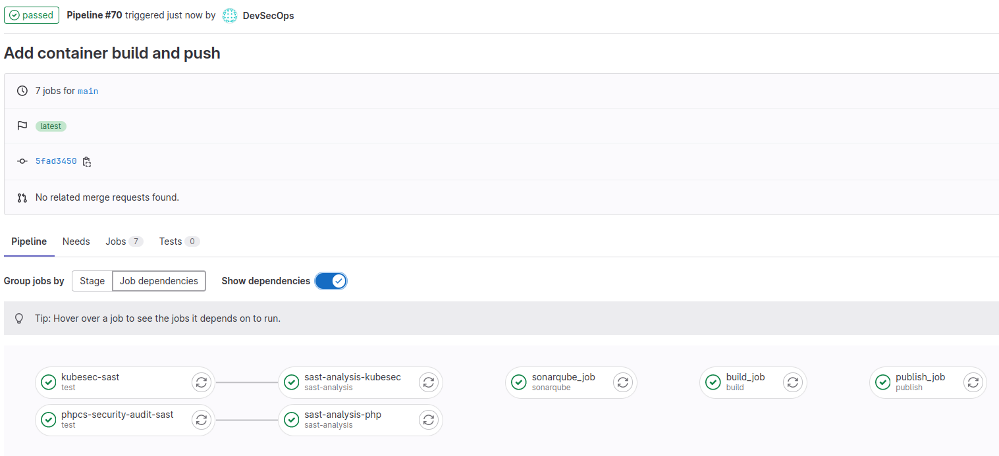

# Lab | Nexus installation and configuration

1. Launch the Nexus instance using the `sonatype/nexus3` container, exposing
   these ports (Host/Container):
   - 8081:8081
   - 5000:5000

   ```console
   > docker run --detach \
     --name nexus \
     --publish 8081:8081 \
     --publish 5000:5000 \
     sonatype/nexus3
   Unable to find image 'sonatype/nexus3:latest' locally
   latest: Pulling from sonatype/nexus3
   36c12cb044ac: Pull complete 
   8a1b09f0eced: Pull complete 
   f47ff8368d44: Pull complete 
   1f37eeb9a088: Pull complete 
   4b6419f9a540: Pull complete 
   cd8e246a9663: Pull complete 
   68721705c831: Pull complete 
   Digest: sha256:88044c8cdbbf1fea42b65b6c785bb88e4e2b2e96b3becd2bfce22f481216a951
   Status: Downloaded newer image for sonatype/nexus3:latest
   1bfde8b8401841bb82e9c00ab6e0efc90860dbbe44771e74cc13e4218d4da162
   ```

   Check the progress:

   ```console
   > docker logs -f nexus
   2023-06-21 10:27:40,499+0000 INFO  [FelixStartLevel] *SYSTEM org.sonatype.nexus.pax.logging.NexusLogActivator - start
   ...
   ```

   Get the installation password:

   ```console
   > docker exec nexus cat /nexus-data/admin.password
   f76d718e-a75c-4a62-8c0a-09ca57e8a6b9
   ```

   In this case credentials will be `admin/f76d718e-a75c-4a62-8c0a-09ca57e8a6b9`.
   It is then time to complete the installation from the web ui console, by logging at:

   [http://172.17.0.1:8081](http://172.17.0.1:8081)

   And complete the installation:

   - Next
   - Chose the new password
   - Configure Anonymous Access -> Enable anonymous access
   - Finish

   Last, create a new docker repository by selecting the wheel icon and then
   `Repository` -> `Create repository` -> `docker (hosted)` with these
   specifications:

   - Name: myproject
     Select `Create an HTTP connector at specified port. Normally used if the server is behind a secure proxy.` -> 5000
     Select `Allow anonymous docker pull ( Docker Bearer Token Realm required )`

   Once `Create repository` is pressed, then the docker repo will be available at
   the 5000 port.

   Last but not least the Docker Bearer Token needs to be activated, from the
   `Security` -> `Realms` section, click on + beside the `Docker Bearer Token` 
   so that it becomes part of the `Active` group.

2. Test credentials:

   ```console
   > docker login -u admin 172.17.0.1:5000
   Password: 
   WARNING! Your password will be stored unencrypted in /home/rasca/.docker/config.json.
   Configure a credential helper to remove this warning. See
   https://docs.docker.com/engine/reference/commandline/login/#credentials-store
   
   Login Succeeded
   ```

3. Move to the GitLab interface in the `CI/CD Settings` of `myproject` at:

   [http://172.17.0.1:8080/devsecops/myproject/-/settings/ci_cd](http://172.17.0.1:8080/devsecops/myproject/-/settings/ci_cd)

   Click `Expand` button of the `Variables` section and add:

   - `NEXUS_HOST`: 172.17.0.1:5000
   - `NEXUS_USERNAME`: admin
   - `NEXUS_PASSWORD`: admin123

   The `NEXUS_HOST` refers to the IP of the docker host, check
   [DevSecOps-Pipeline-Requirements.md](DevSecOps-Pipeline-Requirements.md) to find out how to get it.

   Ensure that for the `NEXUS_PASSWORD` variable the `Mask variable` option is
   selected.

4. Create a `Dockerfile` inside `myproject` with these contents:

   ```dockerfile
   FROM busybox                                                                    
                                                                                
   ENV NCAT_MESSAGE "Container test"                                               
   ENV NCAT_HEADER "HTTP/1.1 200 OK"                                               
   ENV NCAT_PORT "8888"                                                            
                                                                                   
   RUN addgroup -S nonroot && \                                                    
       adduser -S nonroot -G nonroot                                               
                                                                                   
   USER nonroot                                                                    
                                                                                   
   CMD /bin/nc -l -k -p ${NCAT_PORT} -e /bin/echo -e "${NCAT_HEADER}\n\n${NCAT_MESSAGE}"
   ```

   Add the build process to the pipeline adding to `.gitlab-ci.yml` this code:

   ```yaml
   stages:
     ...
     - build
     - publish
   
   variables:
     ...
     ...
     DOCKER_IMAGE_NAME: ncat_http_msg_port
   
   build_job:
     stage: build
     script:
       - echo "Building myproject"
       - docker build -t ${DOCKER_IMAGE_NAME} .
   
   publish_job:
     stage: publish
     script:
       - echo "Publishing image to Nexus Repository..."
       - docker login -u ${NEXUS_USERNAME} -p ${NEXUS_PASSWORD} ${NEXUS_HOST}
       - docker tag ${DOCKER_IMAGE_NAME}:latest ${NEXUS_HOST}/${DOCKER_IMAGE_NAME}:latest
       - docker push ${NEXUS_HOST}/${DOCKER_IMAGE_NAME}:latest
     only:
       - main
   ```

   Commit and push the changes:

   ```console
   > git add . && git commit -m "Add container build and push"
   [main bf304ec35aa8] Add container build and push
    1 file changed, 35 insertions(+), 13 deletions(-)
    rewrite .gitlab-ci.yml (98%)

   > git push
   ```

   And then follow the progress from the GitLab interface:
 
   

   The final result should be the presence of the image inside the Nexus
   interface:

   
