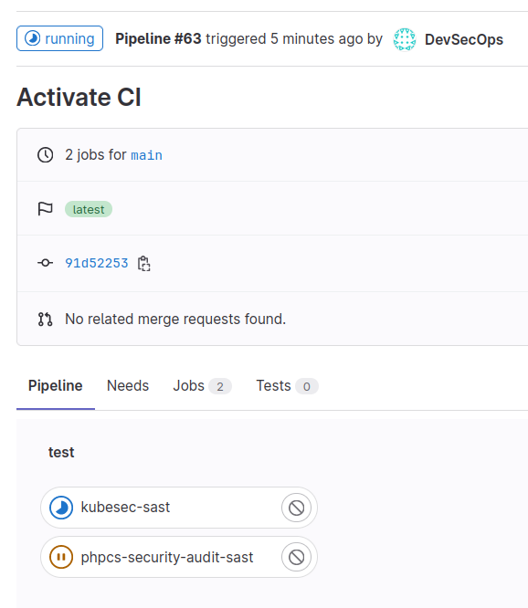
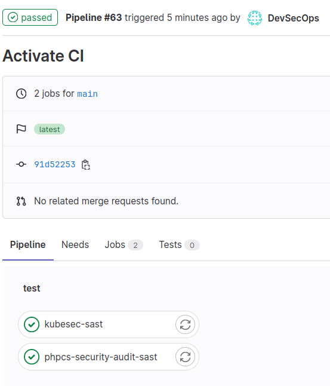
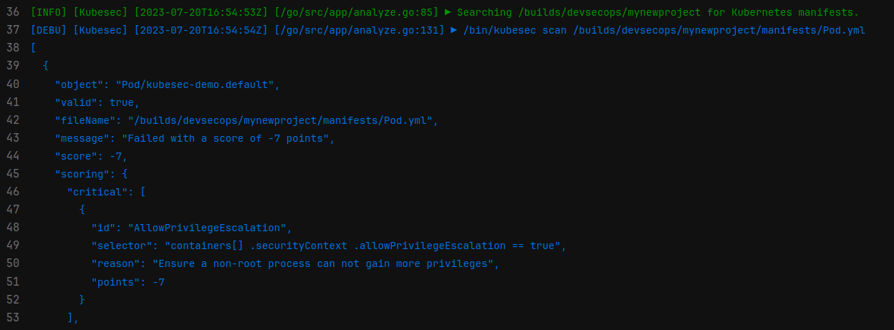

# Exercise | Using GitLab's SAST

1. We will need some code to check GitLab's SAST functionalities, so we will
   create two kind of sources.
   
   A faulty Kubernetes Pod manifest:
   
   ```console
   > mkdir manifests
   
   > cat <<EOF > manifests/Pod.yml
   apiVersion: v1                                                                  
   kind: Pod                                                                       
   metadata:                                                                       
     name: kubesec-demo                                                            
   spec:                                                                           
     containers:                                                                   
     - name: kubesec-demo                                                          
       image: gcr.io/google-samples/node-hello:1.0                                 
       securityContext:                                                            
         allowPrivilegeEscalation: true
   EOF
   ```
   
   A faulty php source code:
   
   ```console
   > mkdir php
   
   > cat <<EOF > php/faulty.php
   <?php
   // This code contains a security vulnerability
   
   // Extract user input from GET parameters
   $id = $_GET['id'];
   
   // SQL query without proper input validation
   $query = "SELECT * FROM users WHERE id = $id";
   
   // Execute the SQL query
   $result = mysqli_query($connection, $query);
   
   // Fetch the data
   $data = mysqli_fetch_assoc($result);
   
   // Display the user's details
   echo "Username: " . $data['username'] . "<br>";
   echo "Email: " . $data['email'] . "<br>";
   EOF
   ```

2. To activate a GitLab CI and use GitLab's SAST functionalities it is
   sufficient to create a file named `.gitlab-ci.yml` inside the root directory
   of your project with these contents:
   
   ```console
   > cat <<EOF > .gitlab-ci.yml
   include:                                                                        
     - template: Jobs/SAST.gitlab-ci.yml
   
   variables:
     SECURE_LOG_LEVEL: "debug"                                                     
     SCAN_KUBERNETES_MANIFESTS: "true"
   
   stages:                                                                         
     - test
   
   sast:                                                                           
     stage: test                                                                   
     artifacts:                                                                    
       paths:                                                                      
         - gl-sast-report.json
   EOF
   ```
   
   This will activate the pre-built SAST template in GitLab `Jobs/SAST.gitlab-ci.yml`
   and launch all the tests for the files, using a debug log level and scanning
   also Kubernetes manifests (by default disabled).
   
   Eventually the scan results will be stored in a file named `gl-sast-report.json`.
   
   To make everything running, it will be enough to create a commit with all the
   newly created files:
   
   ```console
   > git add . && git commit -m "Activate CI"
   [main 91d522538048] Activate CI
    3 files changed, 43 insertions(+)
    create mode 100644 .gitlab-ci.yml
    create mode 100644 manifests/Pod.yml
    create mode 100644 php/faulty.php
   
   > git push
   ```

3. Inside the GitLab web interface, in short, under the CI/CD section of
   `myproject` it will be possible to select `Pipelines` and look at the status:
   
   
   
   And after some time everything should be green:
   
   
   
   Which it seems good, apart from the fact that we introduced faulty code for
   both php sources and Kubernetes manifests, and by looking at the details of
   the pipelines we should see something like this:
   
   
   
   And the same applies for PHP. So, if we want to make this worthy, we need to
   instruct our pipeline to stop if it finds problems.
