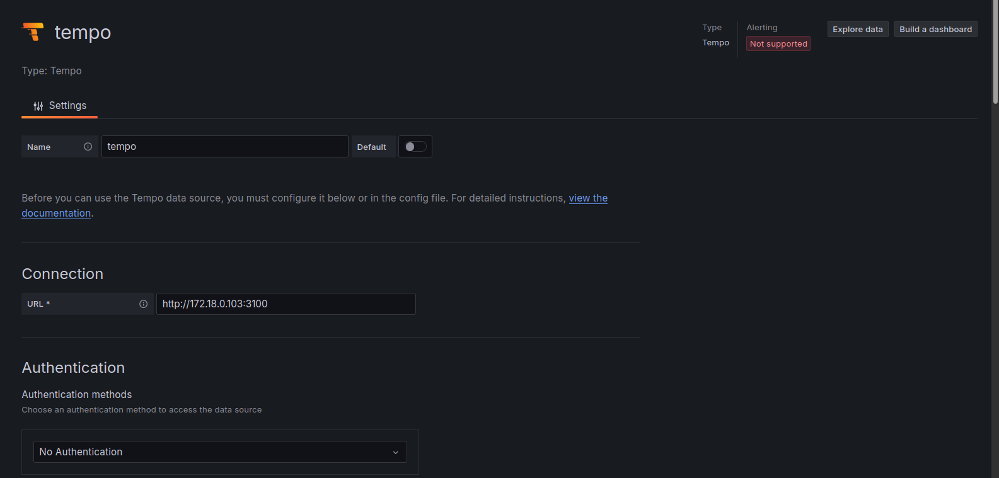
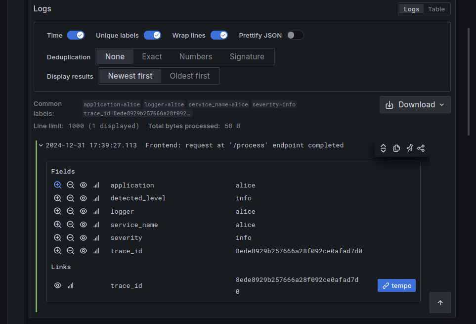
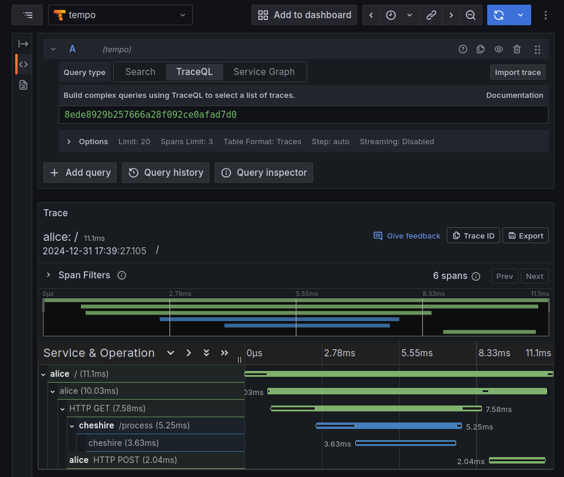

# Configure Grafana Data Sources

Grafana makes it possible to connect different data sources so that a shared
information, like `trace_id` can be used to correlate data, for example a Log
with a Trace.

## Associate Loki logs and Tempo traces

On the Grafana side the two data sources should be configured with the proper
addresses, starting with Tempo:



And continuing with Loki:


In which a `Derived fields` related to the `trace_id` will be associated to the
tempo data source:


Once the data source is available it will be possible to `Explore` it, by
querying the application named `alice`:


This will show, inside the log details, the `trace_id` Tempo link:



Clicking on the Tempo link will show the traces details:



## Extract Grafana configurations

This `curl` invocation will extract the configured Datasource in `JSON` format:

```console
$ curl -s ${GRAFAHOST}/api/datasources \
    --user ${GRAFAUSER}:${GRAFAPASS} | \
    jq '.[]' > Grafana-Datasources.json
```

This one will extract the Dashboard ID of the `GRAFADASH`:

```console
$ GRAFADASH="Python Frontend/Backend Monitoring"

$ GRAFADASHID=$(curl -s "${GRAFAHOST}/api/search?query=&" \
    --user ${GRAFAUSER}:${GRAFAPASS} | \
    jq -r ".[] | select(.title == \"${GRAFADASH}\") | select(.type == \"dash-db\") | .uid")
```

And with the ID it will be possible to export the dashboard `JSON`:

```console
$ curl -sSL -k -H "Content-Type: application/json" \
    --user ${GRAFAUSER}:${GRAFAPASS} \
    "${GRAFAHOST}/api/dashboards/export/:$GRAFADASHID" | \
      jq . > dashboard.json
```

**TBD**: the `dashboard.json` is accepted by Grafana, but imports an empty
dashboard. For now it is safer to export the dashboard from the UI (using the
"Share" button).

## Useful links

For further info check:

- [Send log data to Loki](https://grafana.com/docs/loki/latest/send-data/).
- [Specific Python example](https://pypi.org/project/python-logging-loki/).
- [Pushing Logs to Loki Without Using Promtail](https://medium.com/geekculture/pushing-logs-to-loki-without-using-promtail-fc31dfdde3c6).
