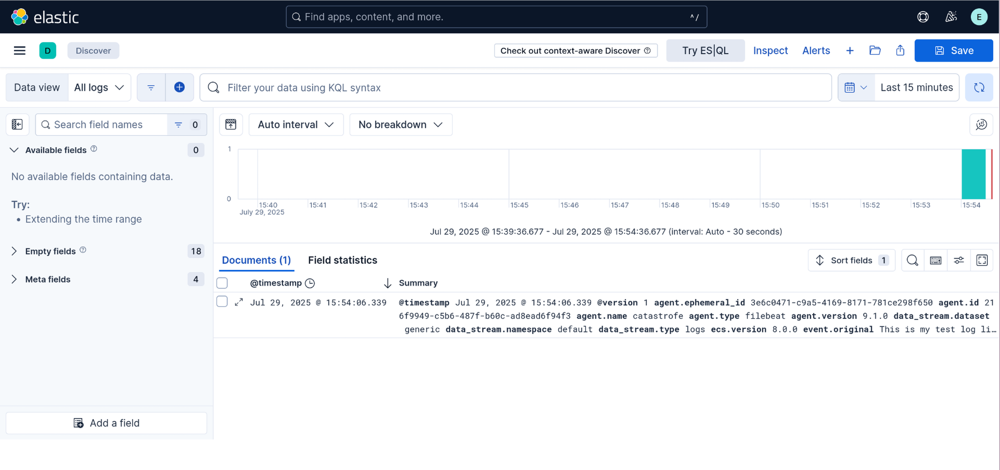

# Lab | Manual test an ECK suite

Simulate logs from command line to the Logstash component of the ECK suite.

## Preparation

The ECK suite needs first the operator to be installed on the destination
Kubernetes:

```console
$ helm repo add elastic https://helm.elastic.co
"elastic" has been added to your repositories

$ helm repo update
Hang tight while we grab the latest from your chart repositories...
...Successfully got an update from the "elastic" chart repository
Update Complete. ⎈Happy Helming!⎈

$ export ECK_OPERATOR_HELM_CHART='3.1.0'

$ helm install elastic-operator elastic/eck-operator \
    --version ${ECK_OPERATOR_HELM_CHART} \
    --namespace elastic-system --create-namespace
NAME: elastic-operator
LAST DEPLOYED: Tue Jul 29 14:56:11 2025
NAMESPACE: elastic-system
STATUS: deployed
REVISION: 1
TEST SUITE: None
NOTES:
1. Inspect the operator logs by running the following command:
   kubectl logs -n elastic-system sts/elastic-operator
```

## The ECK installation

A standard ECK stack can be installed after fixing the `basic-eck.yaml` file
[because of this bug](https://github.com/elastic/cloud-on-k8s/issues/6330) with:

```console
$ export ECK_HELM_CHART='0.15.0'

$ curl -sLO https://raw.githubusercontent.com/elastic/cloud-on-k8s/3.0/deploy/eck-stack/examples/logstash/basic-eck.yaml
(no output)

$ sed -i '/daemonSet: null/d' basic-eck.yaml
(no output)

$ helm install eck-stack-with-logstash elastic/eck-stack \
    --version ${ECK_HELM_CHART} \
    --values basic-eck.yaml \
    --create-namespace \
    --namespace eck
NAME: eck-stack-with-logstash
LAST DEPLOYED: Tue Jul 29 16:24:12 2025
NAMESPACE: eck
STATUS: deployed
REVISION: 1
TEST SUITE: None
NOTES:
Elasticsearch ECK-Stack 0.15.0 has been deployed successfully!

To see status of all resources, run

kubectl get elastic -n eck -l "app.kubernetes.io/instance"=eck-stack-with-logstash

More information on the Elastic ECK Operator, and its Helm chart can be found
within our documentation.

https://www.elastic.co/guide/en/cloud-on-k8s/current/index.html
```

To access the service from the outside, two `LoadBalancer` services should be
created, one related to the `logstash-ls-beats-ls-beats` (port 5044), where the
logs will be sent from filebeat, and `eck-stack-with-logstash-eck-kibana-kb-http`
(port 5601), that will be accessed for the web interface:

```console
$ kubectl --context=kind-ctlplane --namespace=eck \
    expose service logstash-ls-beats-ls-beats \
    --name logstash-ls-beats-ls-beats-lb \
    --type LoadBalancer \
    --load-balancer-ip 172.18.0.108
service/logstash-ls-beats-ls-beats-lb exposed

$ kubectl --context=kind-ctlplane --namespace=eck \
    expose service eck-stack-with-logstash-eck-kibana-kb-http \
    --name eck-stack-with-logstash-eck-kibana-kb-http-lb \
    --type LoadBalancer \
    --load-balancer-ip 172.18.0.107
service/eck-stack-with-logstash-eck-kibana-kb-http-lb exposed
```

## Test manually

With everything in place, it is time to push logs on the interface, and this
can be done downloading `filebeat`:

```console
$ curl -sLO https://artifacts.elastic.co/downloads/beats/filebeat/filebeat-9.1.0-linux-x86_64.tar.gz
(no output)

$ tar -xzf filebeat-9.1.0-linux-x86_64.tar.gz
(no output)

$ sudo cp -v filebeat-9.1.0-linux-x86_64/filebeat /usr/local/bin/
'filebeat-9.1.0-linux-x86_64/filebeat' -> '/usr/local/bin/filebeat'
```

And creating a configuration YAML that will be used for the test:

```console
$ cat <<EOF > filebeat-custom.yml
# filebeat.yml
filebeat.inputs:
  - type: stdin

output.logstash:
  hosts: ["172.18.0.108:5044"]
EOF

$ chmod -v go-w filebeat-custom.yml
mode of 'filebeat-custom.yml' changed from 0664 (rw-rw-r--) to 0644 (rw-r--r--)
```

Pushing a test log line it's a matter of:

```console
$  echo "This is my test log line" | filebeat -e -c filebeat-custom.yml
...
```

The `filebeat` command will remain opened until you press Ctrl+C.

It is also possible to test everything by using an infinite loop to simulate
logs coming from application, in this way:

```console
$ while true; do
    echo "$(date) - $(shuf -n1 -e 'INFO: info log message' 'WARN: warning log message' 'ERROR: error log message' 'DEBUG: debug log message')"
    sleep 1
  sone | filebeat -e -c filebeat-custom.yml
...
```

This will send, every second, one of the four log sample messages to the
Logstash instance.

### Access Kibana to see the logs

To access the Kibana interface with the `elastic` user, you need to get the
password that was generated for it:

```console
$ kubectl --namespace eck get secret elasticsearch-es-elastic-user \
    -o go-template='{{.data.elastic | base64decode}}'
dx93u50Q8Mz9u19pSN01tLj
```

And login into [https://172.18.0.107:5601](https://172.18.0.107:5601) (accepting
the certificate) using the `elastic` user.

You should be already able to see the log message pushed into the interface:


