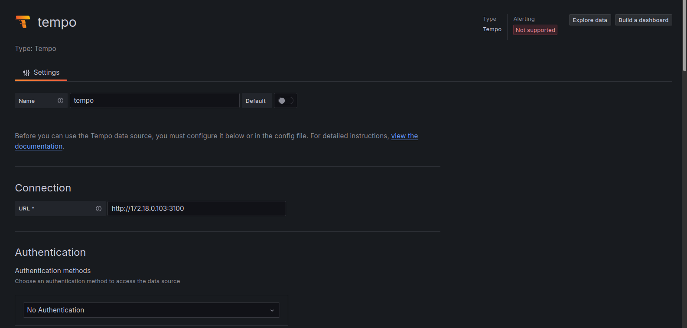
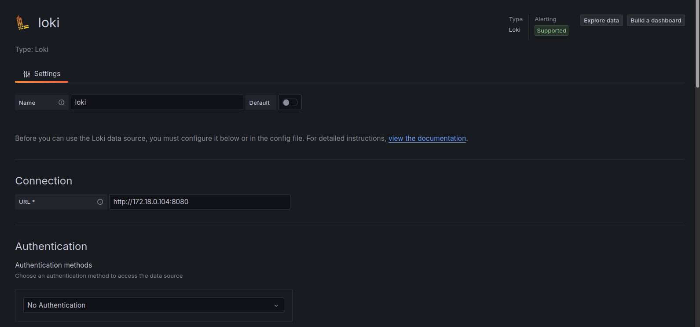
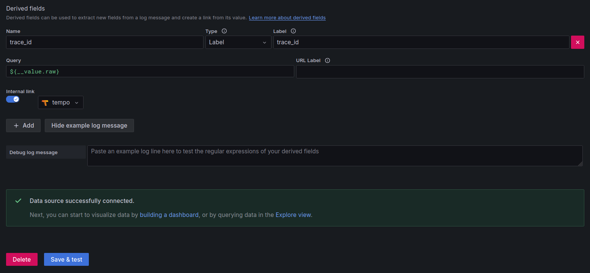
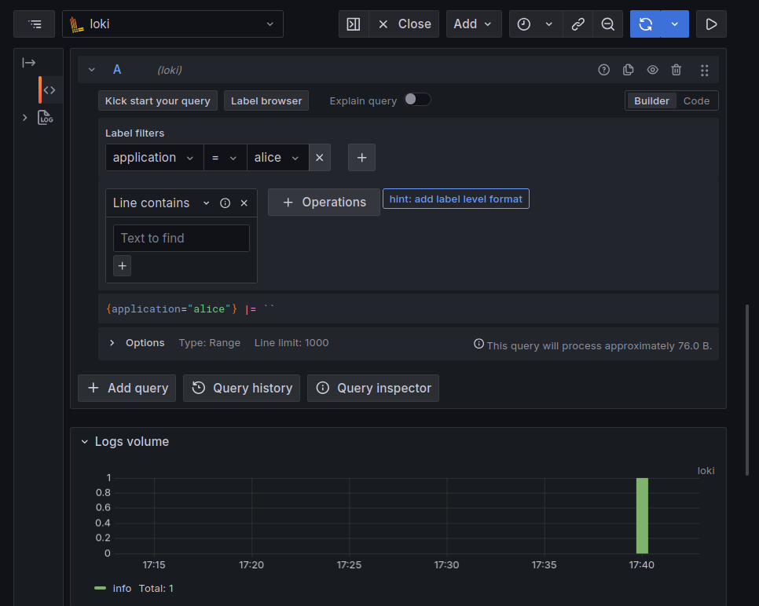
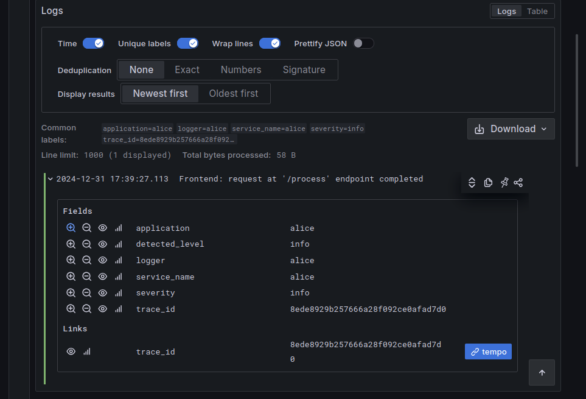
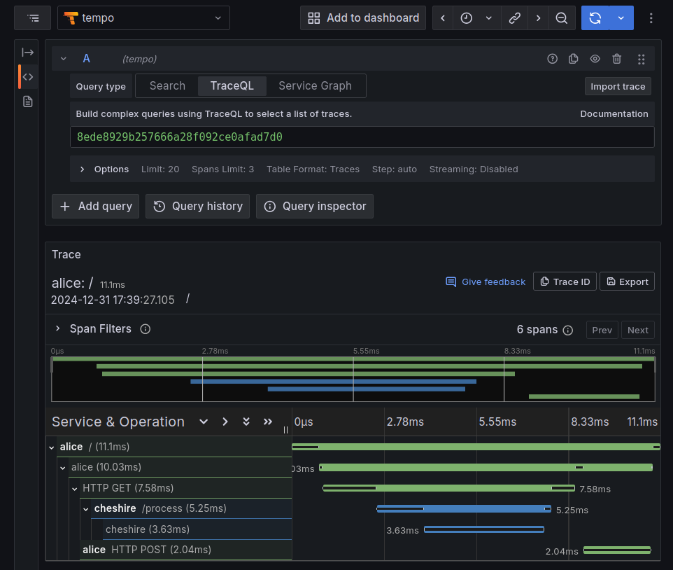

# Python/OpenTelemetry/Jaeger examlple

This is part of the "**Through the looking glass**" observability course which will
explore these topics:

- Prometheus Metrics
- Jeager and Tempo traces
- Loki Logs

This lab is about Jeager and Tempo traces integrated with Loki logs.

## Prepare the environment

### The Python virtual env

Create the virtualenv and install requirements via `pip':

```console
$ pip install flask \
      opentelemetry-api \
      opentelemetry-sdk \
      opentelemetry-instrumentation-flask \
      opentelemetry-instrumentation-requests \
      opentelemetry-instrumentation-logging \
      opentelemetry-exporter-otlp \
      opentelemetry-distro \
      requests \
      python-logging-loki
...
```

### The frontend application

The code of the [Frontend application](cheshire.py).

### The backend application

The code of the [Backend application]().

### The Jaeger instance

The Jaeger instance can be a single container:

```console
$ docker run --rm --name jaeger \
    -p 16686:16686 \
    -p 4318:4318 \
    jaegertracing/all-in-one:1.63.0
...
```

## Test everything

In two different terminals, launch first the backend app:

```console
$ python cheshire.py
 * Serving Flask app 'cheshire'
 * Debug mode: on
WARNING: This is a development server. Do not use it in a production deployment. Use a production WSGI server instead.
 * Running on http://127.0.0.1:5001
Press CTRL+C to quit
 * Restarting with stat
 * Debugger is active!
 * Debugger PIN: 813-701-761
...
```

And then the frontend:

```console
$ python alice.py
 * Serving Flask app 'alice'
 * Debug mode: on
WARNING: This is a development server. Do not use it in a production deployment. Use a production WSGI server instead.
 * Running on http://127.0.0.1:5000
Press CTRL+C to quit
 * Restarting with stat
 * Debugger is active!
 * Debugger PIN: 813-701-761
...
```

Finally look call the [http://localhost:5000](http://localhost:5000) url and
then check the Jaeger web interface at [http://localhost:16686](http://localhost:16686)
to query the related traces.

## Add Tempo to Grafana

Tempo installation

```console
$ kubectl create namespace tempo-system

$ cat <<EOF > helm-tempo.yml
traces:
  otlp:
    http:
      enabled: true
    grpc:
      enabled: true
EOF

$ helm -n tempo-system install --values helm-tempo.yml tempo grafana/tempo-distributed
...

$ kubectl -n tempo-system expose service tempo-query-frontend --name=tempo-query-frontend-lb --type=LoadBalancer
$ eval "TEMPO_FRONTEND_${CTLP}=$(kubectl -n tempo-system get svc tempo-query-frontend-lb -o jsonpath='{.status.loadBalancer.ingress[0].ip}:{.spec.ports[0].port}')"

$ kubectl -n tempo-system expose service tempo-distributor --name=tempo-distributor-lb --type=LoadBalancer
$ eval "TEMPO_DISTRIB_${CTLP}=$(kubectl -n tempo-system get svc tempo-distributor-lb -o jsonpath='{.status.loadBalancer.ingress[0].ip}:{.spec.ports[0].port}')"
```

Now Jaeger should be instructed to send traces to Tempo, to make this possible
it's better to deploy it under Kubernetes, using Helm.

Follow: [https://medium.com/@blackhorseya/deploying-opentelemetry-and-jaeger-with-helm-on-kubernetes-d86cc8ba0332]()

```console
$ helm repo add jaegertracing https://jaegertracing.github.io/helm-charts
"jaegertracing" has been added to your repositories

$ helm repo update
...
Update Complete. ⎈Happy Helming!⎈

$ cat <<EOF > helm-jaeger.yml
provisionDataStore:
  cassandra: false
allInOne:
  enabled: true
  extraEnv:
  - name: OTEL_EXPORTER_OTLP_ENDPOINT
    value: 'https://172.18.0.102:4317'
  - name: OTEL_EXPORTER_OTLP_INSECURE
    value: "true"
storage:
  type: memory
agent:
  enabled: false
collector:
  enabled: false
query:
  enabled: false
EOF

$ helm upgrade --install jaeger jaegertracing/jaeger --namespace jaeger --create-namespace --values helm-jaeger.yml
Release "jaeger" does not exist. Installing it now.
NAME: jaeger
LAST DEPLOYED: Thu Dec 12 10:48:04 2024
NAMESPACE: jaeger
STATUS: deployed
REVISION: 1
TEST SUITE: None
NOTES:
###################################################################
### IMPORTANT: Ensure that storage is explicitly configured     ###
### Default storage options are subject to change.              ###
###                                                             ###
### IMPORTANT: The use of <component>.env: {...} is deprecated. ###
### Please use <component>.extraEnv: [] instead.                ###
###################################################################

You can log into the Jaeger Query UI here:

  export POD_NAME=$(kubectl get pods --namespace jaeger -l "app.kubernetes.io/instance=jaeger,app.kubernetes.io/component=query" -o jsonpath="{.items[0].metadata.name}")
  echo http://127.0.0.1:8080/
  kubectl port-forward --namespace jaeger $POD_NAME 8080:16686

$ kubectl -n jaeger expose svc jaeger-query --name=jaeger-query-lb --type=LoadBalancer
service/jaeger-query-lb exposed

$ kubectl -n jaeger get svc jaeger-query-lb -o jsonpath='{.status.loadBalancer.ingress[0].ip}:{.spec.ports[0].port}'
172.18.0.104:16686

$ kubectl -n jaeger expose svc jaeger-collector --name=jaeger-collector-lb --type=LoadBalancer
service/jaeger-collector-lb exposed

$ kubectl -n jaeger get svc jaeger-collector-lb -o jsonpath='{.status.loadBalancer.ingress[0].ip}:{.spec.ports[0].port}'
172.18.0.105:9411
```

Since, at the moment, there seems to be no way to send traces fro Jaeger to
Tempo, then it would be a lot easier to send traces directly from the apps into
Tempo, so that those can be further integrated with Loki.

This can be achieved by changing the Python scripts to point to the Tempo url:

```python
tempo_exporter = OTLPSpanExporter(
    endpoint = "172.17.0.2:4317",
    insecure = True
)
trace.get_tracer_provider().add_span_processor(BatchSpanProcessor(tempo_exporter))
```

Then it will be time to configure the Grafana datasource related to Tempo.

### Test manually

With `otel-cli`:

```console
$ go install github.com/equinix-labs/otel-cli@latest
...

$ export OTEL_EXPORTER_OTLP_ENDPOINT=http://172.18.0.102:4318/v1/traces

$ ~/go/bin/otel-cli span \
      --service "my-application" \
      --name "send data to the server" \
      --start $(date +%s.%N) \
      --end $(date +%s.%N) \
      --attrs "os.kernel=$(uname -r)" \
      --tp-print --verbose
# trace id: c21425cf2ff5b8a28bcb13822de30a4e
#  span id: ef02a2c9e04e24a7
TRACEPARENT=00-c21425cf2ff5b8a28bcb13822de30a4e-ef02a2c9e04e24a7-01
```

## Logs with Loki

```console
$ cat <<EOF > helm-loki.yml
loki:
  replicas: 1
  schemaConfig:
    configs:
      - from: 2024-04-01
        store: tsdb
        object_store: filesystem
        schema: v13
        index:
          prefix: loki_index_
          period: 24h
  ingester:
    chunk_encoding: snappy
    lifecycler:
      ring:
        replication_factor: 1
  auth_enabled: false

deploymentMode: SimpleScalable

limits_config:
  index_gateway_shard_size: 1

backend:
  replicas: 1
read:
  replicas: 1
write:
  replicas: 1

# Enable minio for storage
minio:
  enabled: true
EOF

$ helm install loki grafana/loki -f helm-loki.yml --create-namespace --namespace loki
...
```

Look for thist status:

```console
$ kubectl -n loki get all
NAME                                READY   STATUS    RESTARTS   AGE
pod/loki-backend-0                  2/2     Running   0          41m
pod/loki-canary-b2zmr               1/1     Running   0          139m
pod/loki-chunks-cache-0             2/2     Running   0          139m
pod/loki-gateway-5565df88fc-zh4hj   1/1     Running   0          139m
pod/loki-minio-0                    1/1     Running   0          139m
pod/loki-read-6cb46d86dc-gfm5c      1/1     Running   0          41m
pod/loki-results-cache-0            2/2     Running   0          139m
pod/loki-write-0                    1/1     Running   0          41m

NAME                                     TYPE           CLUSTER-IP      EXTERNAL-IP    PORT(S)                         AGE
service/loki-backend                     ClusterIP      10.96.152.242   <none>         3100/TCP,9095/TCP               139m
service/loki-backend-headless            ClusterIP      None            <none>         3100/TCP,9095/TCP               139m
service/loki-canary                      ClusterIP      10.96.215.164   <none>         3500/TCP                        139m
service/loki-chunks-cache                ClusterIP      None            <none>         11211/TCP,9150/TCP              139m
service/loki-gateway                     ClusterIP      10.96.164.54    <none>         80/TCP                          139m
service/loki-memberlist                  ClusterIP      None            <none>         7946/TCP                        139m
service/loki-minio                       ClusterIP      10.96.13.24     <none>         9000/TCP                        139m
service/loki-minio-console               ClusterIP      10.96.178.25    <none>         9001/TCP                        139m
service/loki-minio-svc                   ClusterIP      None            <none>         9000/TCP                        139m
service/loki-query-scheduler-discovery   ClusterIP      None            <none>         3100/TCP,9095/TCP               139m
service/loki-read                        ClusterIP      10.96.195.151   <none>         3100/TCP,9095/TCP               139m
service/loki-read-headless               ClusterIP      None            <none>         3100/TCP,9095/TCP               139m
service/loki-results-cache               ClusterIP      None            <none>         11211/TCP,9150/TCP              139m
service/loki-write                       ClusterIP      10.96.253.121   <none>         3100/TCP,9095/TCP               139m
service/loki-write-headless              ClusterIP      None            <none>         3100/TCP,9095/TCP               139m

NAME                         DESIRED   CURRENT   READY   UP-TO-DATE   AVAILABLE   NODE SELECTOR   AGE
daemonset.apps/loki-canary   1         1         1       1            1           <none>          139m

NAME                           READY   UP-TO-DATE   AVAILABLE   AGE
deployment.apps/loki-gateway   1/1     1            1           139m
deployment.apps/loki-read      1/1     1            1           139m

NAME                                      DESIRED   CURRENT   READY   AGE
replicaset.apps/loki-gateway-5565df88fc   1         1         1       139m
replicaset.apps/loki-read-5675d67b5d      0         0         0       139m
replicaset.apps/loki-read-58b96ffd75      0         0         0       84m
replicaset.apps/loki-read-5df85bcdb6      0         0         0       86m
replicaset.apps/loki-read-6884bbd7ff      0         0         0       94m
replicaset.apps/loki-read-6cb46d86dc      1         1         1       41m
replicaset.apps/loki-read-79b4f777f       0         0         0       43m
replicaset.apps/loki-read-8fcb67966       0         0         0       42m
replicaset.apps/loki-read-cbdd5fd86       0         0         0       59m

NAME                                  READY   AGE
statefulset.apps/loki-backend         1/1     139m
statefulset.apps/loki-chunks-cache    1/1     139m
statefulset.apps/loki-minio           1/1     139m
statefulset.apps/loki-results-cache   1/1     139m
statefulset.apps/loki-write           1/1     139m
```

And expose Loki API service:

```console
$ kubectl -n loki expose deployment loki-gateway --name=loki-gateway-lb --type=LoadBalancer
service/loki-gateway-lb exposed

$ kubectl -n loki get svc loki-gateway-lb -o jsonpath='{.status.loadBalancer.ingress[0].ip}:{.spec.ports[0].port}'
172.18.0.104:8080
```

Change Python source to include the log writing:

```python
# Configure Logging
loki_url = "http://172.18.0.104:8080/loki/api/v1/push"
handler = logging_loki.LokiHandler(
    url=loki_url,
    tags={"application": APP_NAME},
    version="1",
)
logger = logging.getLogger(APP_NAME)
logging.basicConfig(level=logging.INFO)
logger.addHandler(handler)
```

And to associate the log to the `trace_id`, add extra log info, using `tags`:

```python
        trace_id = trace.get_current_span().get_span_context().trace_id
        message = "Frontend: request at '/process' endpoint completed"
        logger.info(f"{message}", extra={"tags": {"trace_id": f"{trace_id:032x}"}})
```

For further info check:

- [Send log data to Loki](https://grafana.com/docs/loki/latest/send-data/).
- [Specific Python example](https://pypi.org/project/python-logging-loki/).
- [Pushing Logs to Loki Without Using Promtail](https://medium.com/geekculture/pushing-logs-to-loki-without-using-promtail-fc31dfdde3c6).

### Configure Grafana to associate Loki logs and Tempo traces

On the Grafana side the two data sources should be configured with the proper
addresses, starting with Tempo



And continuning with Loki:



In which a `Derived fields` related to the `trace_id` will be associated to the
tempo data source:



Once the data source is available it wil be possible to `Explore` it, by
querying the application named `alice`:



This will show, inside the log details, the `trace_id` Tempo link:



Clicking on the Tempo link will show the traces details:


