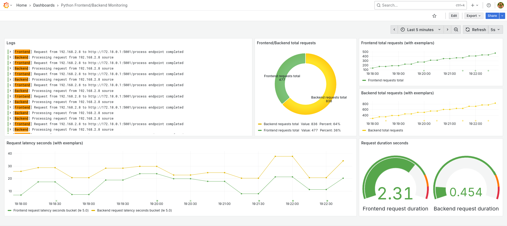

# Test Telemetry with Python

This lab shows how it is possible to set a Python Frontend/Backend application
to show different stages of telemetry coverage.

## The working directory

Working directory is `python-app` containing:

- `launch.sh`: a script used to start the different stages of the application.
- `requirements.txt`: a text file containing the Python requirements for the
  scripts.
- `simulate-traffic.sh`: a script used to stress the application.
- The three stages directories:
  - `Stage-1-Simple`: basic example.
  - `Stage-2-Direct`: an example that writes data directly to the telemetry
    backends.
  - `Stage-3-OTel`: an example that writes data to an `open-telemetry` collector
    by using Python's open-telemetry libraries.

## Preparing the environment

The best way to test everything is by creating a Python Virtual Environment and
installing in there all the requirements:

```console
$ python3 -m venv ~/Labs/venvs/otel
(no output)

$ source ~/Labs/venvs/otel/bin/activate
(no output)

(otel) $ pip install -r python-app/requirements.txt
...
```

From now on the applications can be launched using `launch.sh`:

```console
(otel) $ cd python-app
(no output)

(otel) $  ./launch.sh Stage-1-Simple
~/Git/kiratech/labs/Through-The-Looking-Glass/python-app/Stage-1-Simple ~/Git/kiratech/labs/Through-The-Looking-Glass/python-app
 * Serving Flask app 'cheshire'
 * Debug mode: off
INFO:werkzeug:WARNING: This is a development server. Do not use it in a production deployment. Use a production WSGI server instead.
 * Running on http://172.18.0.1:5001
INFO:werkzeug:Press CTRL+C to quit
 * Serving Flask app 'alice'
 * Debug mode: off
INFO:werkzeug:WARNING: This is a development server. Do not use it in a production deployment. Use a production WSGI server instead.
 * Running on http://172.18.0.1:5000
INFO:werkzeug:Press CTRL+C to quit
```

## Testing the different stages

There are three stages that expose pros and cons of each implementation:

- [Test-Telemetry-Python-Stage-1.md](): the simplest, direct output logging.
- [Test-Telemetry-Python-Stage-2.md](): an implementation where each telemetry 
  data is loaded or exposed directly to the backend.
- [Test-Telemetry-Python-Stage-3.md](): an implementation where everything
  passes through the OpenTelemetry Collector, a centralized entity that takes
  care of distributing telemetry data to all the backends.

## Loading a Grafana dashboard

A Grafana dashboard that shows the Full telemetry of the Python application is
available inside this repository, in the expected JSON format
[grafana/Grafana-Dashboard-Python-Frontend-Backend-App.json]().

To activate it, first install all the components as described in:

- [Prometheus-Installation-And-Test.md]()
- [Tempo-Installation.md]()
- [Loki-Installation.md]()
- [Grafana-Installation.md]()

Then, after logging into the Grafana web interfaces, from `Dashboards` -> `New`
-> `Import`, click `Upload dashboard JSON file` or drag and drop the JSON file.

It will ask to select the Logs and Prometheus sources, which will be
respectively `Loki` and `Prometheus`, and then while simulating the traffic, the
Dashboard named `Python Frontend/Backend Monitoring` will start populating like
this:


