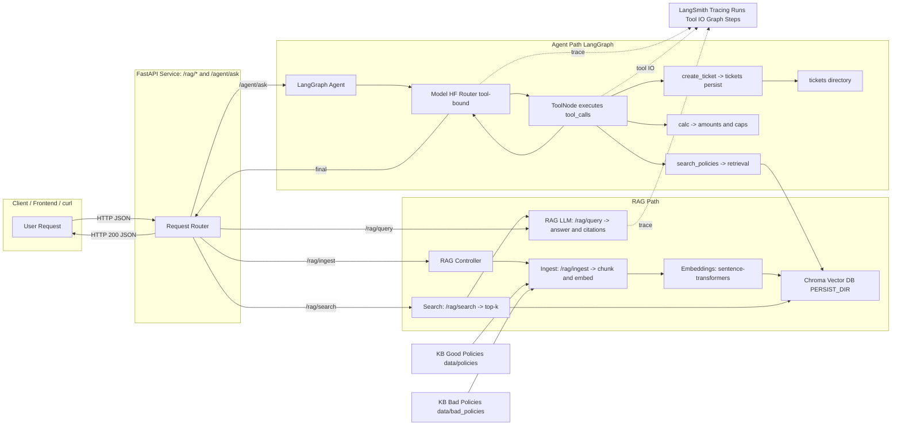

# Lab: Agents & RAG with LangChain, LangGraph & LangSmith

In **Lab 3** we explored *prompt engineering patterns* and *LoRA fine-tuning* to steer and adapt LLMs. We learned that smarter prompts and light-weight fine-tuning improve response quality, but **they don’t give the model access to your private knowledge** nor the ability to **act**.

**Lab 4 connects the dots**:

* We build a **RAG** (Retrieval-Augmented Generation) pipeline to ground answers in **our policy KB**.
* We wrap the LLM inside a **LangGraph agent** that can **use tools** (retrieve policies, compute amounts, open tickets).
* We make executions **observable end-to-end** with **LangSmith** (mandatory): every run, step, prompt, and tool call is traceable.

You will deploy a FastAPI backend with `/rag/*` and `/agent/ask`, run a curated test suite, and demonstrate how **changing only the KB** (“good” vs “bad” policies) flips decisions.

---

## 1. Tooling Overview

### 1.1 Tools, concepts and our usage

| Tool                                | Why we use it                                       | What you’ll touch                         | Key commands / env                                     |                |
| ----------------------------------- | --------------------------------------------------- | ----------------------------------------- | ------------------------------------------------------ | -------------- |
| [**FastAPI**](https://fastapi.tiangolo.com/)                        | Expose RAG & Agent endpoints as HTTP APIs           | `src/lab_service/app.py`, Pydantic models | `uvicorn src.lab_service.app:app --reload`|                |
| [**LangChain** ](https://docs.langchain.com/oss/python/langchain/overview)                 | Model wrappers, message schema, tool binding        | `Chat*` wrapper, `@tool` functions        | `chat_model = ... .bind_tools(TOOLS)`                  |                |
| [**LangGraph**](https://docs.langchain.com/oss/python/langgraph/overview)                       | Deterministic agent control flow (LLM ↔ Tools loop) | `StateGraph`, `ToolNode`, `MemorySaver`   | Graph build in `agent_graph.py`                        |                |
| [**Chromadb**](https://docs.trychroma.com/docs/overview/introduction)                          | Persisted vector store for policy KB                | ingest/retrieve in `rag_core.py`          | `PERSIST_DIR=artifacts/chroma_*`                       |                |
| [**Sentence Transformers**](https://huggingface.co/sentence-transformers/all-MiniLM-L6-v2)           | Text embeddings for semantic search                 | `EMB_MODEL` in `.env`                     | `EMB_MODEL=sentence-transformers/all-MiniLM-L6-v2`     |                |
| [**Hugging Face Inference**](https://huggingface.co/openai/gpt-oss-20b) | Hosted LLM with OpenAI-compatible API               | `HF_MODEL_ID` in `.env`                   | `HF_MODEL_ID=openai/gpt-oss-20b`          |                |
| [**LangSmith**](https://docs.langchain.com/)          | Tracing, run trees, tool I/O, comparisons           | Project/tags via env                      | `LANGSMITH_TRACING=true`, `LANGSMITH_API_KEY=...`      |                |
| **[curl](https://curl.se/) / [jq](https://jqlang.org/)**                       | Repeatable test suite & quick diffs                 | cURL snippets in README                   | `curl ...                                              | jq`            |

---

### 1.2 Sentence Transformers (Embeddings)

* **Role:** Encode chunks and queries for similarity search.
* **Config:** `.env -> EMB_MODEL=sentence-transformers/all-MiniLM-L6-v2`
* **Notes:** Keep chunk size/overlap reasonable (e.g., 1200/200); adjust `k` (8–12).
* **Docs:** **(add link)**

### 1.3 Chroma (Vector Store)

* **Role:** Persisted embeddings for semantic retrieval (per-KB isolation).
* **Touchpoints:** `rag_core.py` (`ingest`, `retrieve`), `PERSIST_DIR` in `.env`.
* **Ops:**

  ```bash
  curl -s -X POST :8000/rag/ingest -H "Content-Type: application/json" \
    -d '{"source_dir":"data/policies","reset":true}'
  ```
* **Notes:** Use a **different** `PERSIST_DIR` per KB (`chroma_policies`, `chroma_bad`) to avoid cross-contamination.
* **Docs:** **(add link)**

### 1.3 Hugging Face Inference Router (LLM)

* **Role:** Hosted LLM with OpenAI-compatible endpoint; stable tool-calling support (provider-agnostic).
* **Config:** `.env -> HF_MODEL_ID=...`, token in `HUGGINGFACEHUB_API_TOKEN`.
* **Notes:** Prefer compact instruct models for latency (e.g., Phi-3.5, Qwen2.5-7B-Instruct).
* **Docs:** **(add link)**

### 1.4 LangChain (Models & Tools)

* **Role:** Uniform chat model abstraction; declarative tool definitions.
* **Touchpoints:** Tool functions in `agent_graph.py` (`@tool`), model wrapper setup.
* **Key pattern:**

  ```python
  chat_model = ChatOpenAI(...).bind_tools(TOOLS)   # or ChatHuggingFace(...).bind_tools(TOOLS)
  ```
* **Notes:** Ensure tool names/args match what the model will emit.
* **Docs:** **(add link)**

### 1.5 LangGraph (Agent Orchestration)

* **Role:** State machine controlling LLM ↔ Tools turns; prevents “runaway” behaviors.
* **Touchpoints:** `agent_graph.py` (`StateGraph`, `ToolNode`, conditional edges, `MemorySaver`).
* **Key pattern:**

  ```python
  graph = StateGraph(AgentState)
  graph.add_node("agent", call_model)
  graph.add_node("tools", ToolNode(TOOLS))
  graph.add_conditional_edges("agent", route_after_model)  # to 'tools' or END
  graph.add_edge("tools", "agent")
  agent_graph = graph.compile(checkpointer=MemorySaver())
  ```
* **Notes:** Add a `recursion_limit` in `.invoke(...)` to avoid loops.
* **Docs:** **(add link)**

### 1.6 LangSmith (Observability)

* **Role:** Trace every call: prompts, tool I/O, graph edges, timings; compare runs (“good” vs “bad” KB).
* **Config:**

  ```bash
  export LANGSMITH_TRACING=true
  export LANGSMITH_API_KEY=***
  export LANGSMITH_PROJECT=agents-and-rag-lab
  export LANGSMITH_RUN_TAGS=local,lab4
  ```
* **What to inspect:** run tree, retrieved chunks, tool sequences, errors; compare two runs side-by-side.
* **Docs:** **(add link)**

---

## 2. Architecture Overview



**High-level flows**

1. Client calls FastAPI (`/rag/query` or `/agent/ask`).
2. **RAG**: queries Chroma (embeddings: `sentence-transformers/...`) and returns relevant policy chunks + metadata (file, chunk, policy IDs).
3. **Agent (LangGraph)**: model **bound to tools** decides when to:

   * call `search_policies` to retrieve evidence,
   * call `calc` math on refunds/vouchers/caps,
   * call `create_ticket` persist ticket with ID + local file.

4. **LangSmith** traces every step: prompts, tool I/O, graph edges.

---

## 3. Repository Layout

```
src/lab_service/
  app.py               # FastAPI entrypoint for router endpoints
  models.py            # Pydantic models of requests and responses
  rag_core.py          # ingest / retrieve / generate answers with citations
  agent_graph.py       # LangGraph graph + tools + system prompt
  config.py            # environment & defaults (models, paths)
data/policies/         # "good" policies (RET/SLA/DIG/LOY/TCK/EXM)
data/bad_policies/     # "bad" policies (same IDs, harsher rules)
tickets/               # json tickets created by create_ticket tool
artifacts/chroma_*     # Chroma persist directories per KB
```

---

## 4. Prerequisites

* Python **3.12+** 
* **HuggingFace** account & API key
* `curl` and `jq`
* **LangSmith** account & API key

---

## 5. Environment Setup

This lab assumes that Python is already installed, the repository kiratech/labs is accessible, and Git is properly configured on your local machine.  
As in the previous lab, in order to execute this laboratory, you will be asked to install a set of tools common in Agent engineering field.

### 5.1 Create a virtual environment

A virtual environment allows you to isolate the project's dependencies from the system-wide ones. If you have an active conda environment, please deactivate it first via `conda deactivate`.

```bash
python -m venv .venv && source .venv/bin/activate
```

You should see the prompt change to indicate that the virtual environment is active (e.g., `(.venv) user@machine:~/path/to/repo`).

### 5.2 Create and edit `.env`:

This project uses environment variables for configuration. Create a `.env` file by copying the provided example:

```bash
cp .env.example .env
```

### 5.3 Install & run the FastAPI service:

Now, install the required dependencies and start the FastAPI service:

```bash
pip install -r requirements.txt
uvicorn src.lab_service.app:app --reload
```

The service will be available at `http://localhost:8000`.

### 5.4 Test the service:

```bash
curl -X 'GET' \
  'http://127.0.0.1:8000/healthz' \
  -H 'accept: application/json'
```

---

## 6. Concepts in Practice

### 6.1 RAG (Retrieval-Augmented Generation)

* **Chunking:** split Markdown policies into manageable pieces.
* **Embeddings:** encode chunks with `EMB_MODEL` into vectors.
* **Vector store:** persist in **Chroma** (`PERSIST_DIR`) for fast similarity search.
* **Citations:** return `source`, `chunk`, and **policy IDs** (e.g., `[SLA-214]`) so answers are **verifiable**.

**Operations**

* **Ingest:** parse & embed files into Chroma.
* **Search:** return top-k similar chunks for a query.
* **Query:** prompt LLM with retrieved evidence to produce a grounded answer.

> Where to look in code: `rag_core.py` (ingest/retrieve/answer).
> Add doc link: **(add link to your RAG design doc)**

---

### 6.2 LangGraph Agent

* **StateGraph:** keeps the message state (`messages`) and routes between nodes.
* **Tool binding:** model is `.bind_tools(TOOLS)` so it can **emit tool calls**.
* **Loop:** `agent -> tools -> agent` until no more tool calls.
* **System prompt:** instructs *when* to use tools (retrieve first for policy questions, compute amounts, escalate only if TCK conditions apply).

**Tools implemented**

* `search_policies(query:str) -> JSON[{source,chunk,ids,excerpt}]`

  * Uses RAG retrieval; **extracts policy IDs** with a regex for reliable citations.
* `calc(expr:str) -> number`

  * For restocking, vouchers, and **cap checks** (`min(base_amount, cap)` logic—either here or done by separate helper).
* `create_ticket(category: "logistics"|"returns", reason:str)`

  * Generates a **deterministic ticket_id**, writes a file under `tickets/`, returns JSON payload.

> Where to look in code: `agent_graph.py` (graph wiring, tools, routing).
> Add doc link (LangGraph intro): **(add link)**

---

### 6.3 LangSmith Observability

* **Enable with env vars** (already in `.env`).
* Every call to `/rag/*` and `/agent/ask` will appear as **runs**.
* Inspect:

  * Prompts & variables at each step,
  * Tool call I/O,
  * Graph edges & timing,
  * Errors and retries.

**Operations**

* **Filter by project and tags**.
* **Compare runs** (e.g., with “good” vs “bad” policies).
* **Share traces** with teammates.

> Where to click: LangSmith dashboard — **(add your workspace link)**
> Add “How to interpret a run tree” cheatsheet — **(add link)**

---

## 7. Step-by-Step: Running RAG

### 7.1 Ingest the KB

```bash
curl -s -X POST http://localhost:8000/rag/ingest \
  -H "Content-Type: application/json" \
  -d '{"source_dir":"data/policies","reset":true}'
```

**What happens**

* Documents are loaded from `KB_DIR`.
* Chunks are embedded with `EMB_MODEL`.
* Vectors are saved to `PERSIST_DIR` (Chroma).

### 7.2 Explore search results

```bash
curl -s -X POST http://localhost:8000/rag/search \
  -H "Content-Type: application/json" \
  -d '{"query":"voucher cap consumer","k":8}' | jq
```

**What to check**

* Each hit includes `source`, `chunk`, `excerpt`, and `ids` (e.g., `[SLA-214]`).
* If empty or irrelevant: verify `KB_DIR`, refresh embeddings, adjust `k`.

### 7.3 Ask with citations (RAG only)

```bash
curl -s -X POST http://localhost:8000/rag/query \
  -H "Content-Type: application/json" \
  -d '{"question":"What is the voucher cap for late deliveries and when does it apply?"}' | jq
```

**Expected**

* A short answer citing `[SLA-214]`.
* See the run in **LangSmith** and inspect retrieved chunks.

---

## 8. Step-by-Step: Running the Agent

### 8.1 Basic “ticketing” scenario

```bash
curl -s -X POST http://localhost:8000/agent/ask \
  -H "Content-Type: application/json" \
  -d '{
    "question":"Delivery is 11 business days late. If policy requires, open a logistics ticket and summarize the compensation with sources.",
    "thread_id":"lab-01"
  }' | jq -r '.final_answer'
```

**What happens**

* The model should call `search_policies` (find `[TCK-511]` and `[SLA-213][SLA-214]`).
* If conditions met, it should call `create_ticket` and return a **real** `ticket_id`.
* Check `tickets/` for a new file.
* Open the **LangSmith** run: you’ll see both tool calls in the tree.

### 8.2 "Calc + Cap" scenario

```bash
curl -s -X POST http://localhost:8000/agent/ask \
  -H "Content-Type: application/json" \
  -d '{
    "question":"Opened laptop (working) returned on day 10, price €1,200; delivery 5 business days late. Compute restocking and voucher (respect caps) and give the net outcome with citations.",
    "thread_id":"lab-02"
  }' | jq -r '.final_answer'
```

**Expected**

* Restocking: **10% = €120** `[RET-103]`.
* Voucher: **20% = €240**, **capped at €50** `[SLA-212][SLA-214]`.
* Net outcome clearly stated.
* In LangSmith, confirm a `calc` call occurred.

### 8.3 Digital activation error scenario

```bash
curl -s -X POST http://localhost:8000/agent/ask \
  -H "Content-Type: application/json" \
  -d '{
    "question":"Digital license shows a server-side activation error at day 5. If required, open a returns ticket and confirm refund eligibility with sources.",
    "thread_id":"lab-03"
  }' | jq -r '.final_answer'
```

**Expected**

* Evidence: `[DIG-312]` (refund allowed), general rule `[DIG-311]`.
* Ticket: `returns` via `[TCK-531]` when applicable.
* See both tool calls in LangSmith.

> Tip: reuse the **10 test prompts** you prepared to cover `search_policies` -> `calc` -> `create_ticket` combinations.

---

## 9. KB Swap: "Good" vs "Bad" Policies (RAG Contrast Demo)

**Goal:** prove the system’s behavior depends on the KB (not hidden model bias).

### 9.1 Re-ingest:

```bash
curl -s -X POST http://localhost:8000/rag/ingest \
  -H "Content-Type: application/json" \
  -d '{"source_dir":"data/bad_policies","reset":true}'
```

### 9.2 Re-run the **same** agent calls as above and compare:

* Different **citations** (same IDs, harsher content).
* Different **decisions** (smaller vouchers, stricter returns, fewer tickets).
* In **LangSmith**, compare run trees side-by-side.
