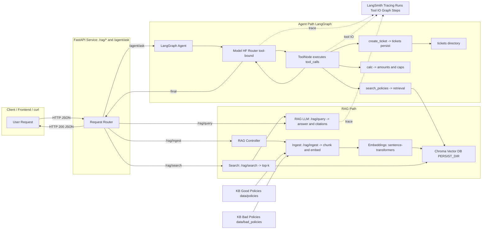

# Lab: Agents & RAG with LangChain, LangGraph & LangSmith

In **Lab 3** we explored *prompt engineering patterns* and *LoRA fine-tuning* to steer and adapt LLMs. We learned that smarter prompts and light-weight fine-tuning improve response quality, but **they don’t give the model access to your private knowledge** nor the ability to **act**.

**Lab 4 connects the dots**:

* We build a **RAG** (Retrieval-Augmented Generation) pipeline to ground answers in **our policy KB**.
* We wrap the LLM inside a **LangGraph agent** that can **use tools** (retrieve policies, compute amounts, open tickets).
* We make executions **observable end-to-end** with **LangSmith** (mandatory): every run, step, prompt, and tool call is traceable.

You will deploy a FastAPI backend with `/rag/*` and `/agent/ask`, run a curated test suite, and demonstrate how **changing only the KB** (“good” vs “bad” policies) flips decisions.

---

## 1. Tooling Overview

### 1.1 Tools, concepts and our usage

| Tool                                | Why we use it                                       | What you’ll touch                         | Key commands / env                                     |                |
| ----------------------------------- | --------------------------------------------------- | ----------------------------------------- | ------------------------------------------------------ | -------------- |
| [**FastAPI**](https://fastapi.tiangolo.com/)                        | Expose RAG & Agent endpoints as HTTP APIs           | `src/lab_service/app.py`, Pydantic models | `uvicorn src.lab_service.app:app --reload`|                |
| [**LangChain** ](https://docs.langchain.com/oss/python/langchain/overview)                 | Model wrappers, message schema, tool binding        | `Chat*` wrapper, `@tool` functions        | `chat_model = ... .bind_tools(TOOLS)`                  |                |
| [**LangGraph**](https://docs.langchain.com/oss/python/langgraph/overview)                       | Deterministic agent control flow (LLM ↔ Tools loop) | `StateGraph`, `ToolNode`, `MemorySaver`   | Graph build in `agent_graph.py`                        |                |
| [**Chromadb**](https://docs.trychroma.com/docs/overview/introduction)                          | Persisted vector store for policy KB                | ingest/retrieve in `rag_core.py`          | `PERSIST_DIR=artifacts/chroma_*`                       |                |
| [**Sentence Transformers**](https://huggingface.co/sentence-transformers/all-MiniLM-L6-v2)           | Text embeddings for semantic search                 | `EMB_MODEL` in `.env`                     | `EMB_MODEL=sentence-transformers/all-MiniLM-L6-v2`     |                |
| [**Hugging Face Inference**](https://huggingface.co/openai/gpt-oss-20b) | Hosted LLM with OpenAI-compatible API               | `HF_MODEL_ID` in `.env`                   | `HF_MODEL_ID=openai/gpt-oss-20b`          |                |
| [**LangSmith**](https://docs.langchain.com/)          | Tracing, run trees, tool I/O, comparisons           | Project/tags via env                      | `LANGSMITH_TRACING=true`, `LANGSMITH_API_KEY=...`      |                |
| **[curl](https://curl.se/) / [jq](https://jqlang.org/)**                       | Repeatable test suite & quick diffs                 | cURL snippets in README                   | `curl ... \| jq`            |

---

### 1.2 Sentence Transformers (Embeddings)

In any RAG pipeline, semantic understanding starts from good embeddings. Sentence Transformers provide pre-trained models that map text into high-dimensional vectors capturing meaning rather than exact words. This enables semantic similarity search, where “voucher limit” and “compensation cap” become close neighbors in vector space, making retrieval far more robust than keyword search.

* **Role:** Encode chunks and queries for similarity search.
* **Config:** `.env: EMB_MODEL=sentence-transformers/all-MiniLM-L6-v2`

### 1.3 Chroma (Vector Store)

Once texts are embedded, they need a persistent home, a place where vectors can be efficiently stored and retrieved. Chroma serves as this lightweight vector database, ideal for local labs or prototypes. It supports fast similarity queries and easy integration with LangChain, making it a natural choice for experimenting with multiple knowledge bases ("good" vs "bad" policies).

* **Role:** Persisted embeddings for semantic retrieval (per-KB isolation).
* **Config:** `.env: PERSIST_DIR=data/policies`

### 1.4 Hugging Face Inference Router (LLM)

The brain of our system remains a Large Language Model. Using Hugging Face Inference endpoints provides a cloud-hosted, OpenAI-compatible way to run open-source models with predictable latency and cost. This abstraction lets you switch between providers (e.g., Mistral, Phi-3, Qwen) while maintaining the same API shape for your tools and prompts.

* **Role:** Hosted LLM with OpenAI-compatible endpoint; stable tool-calling support (provider-agnostic).
* **Config:** `.env: HF_MODEL_ID=openai/gpt-oss-20b`, token in `HUGGINGFACEHUB_API_TOKEN`.

### 1.5 LangChain (Models & Tools)

LangChain acts as the glue layer between models and logic. It standardizes chat interfaces, message formats, and tool bindings, so your LLM can "call" functions in a structured way. Think of it as the framework that turns a passive model into an interactive assistant capable of invoking tools, parsing arguments, and reasoning over results.

* **Role:** Uniform chat model abstraction and declarative tool definitions.

### 1.6 LangGraph (Agent Orchestration)

LangGraph builds on LangChain but introduces explicit orchestration: instead of a simple loop, it defines a graph-based control flow between the LLM and its tools. Each node represents a reasoning or action step, and edges define transitions based on outcomes. This deterministic structure ensures reproducibility, prevents runaway loops, and gives you full visibility into how your agent reasons and acts.

* **Role:** State machine controlling LLM ↔ Tools turns; prevents “runaway” behaviors.
* **Key pattern:**

  ```python
  graph = StateGraph(AgentState)
  graph.add_node("agent", call_model)
  graph.add_node("tools", ToolNode(TOOLS))
  graph.add_conditional_edges("agent", route_after_model)  # to 'tools' or END
  graph.add_edge("tools", "agent")
  agent_graph = graph.compile(checkpointer=MemorySaver())
  ```

#### 1.6.1 Reasoning Strategies: ReAct and Plan-and-Execute Agents

Modern LLM agents do not simply call tools on demand: they reason, plan, and act. Two common reasoning strategies used in agent design are ReAct and Plan-and-Execute.

**ReAct (Reason + Act)**: This approach interleaves reasoning steps (“thoughts”) and actions in a single loop. The model reflects on the problem, chooses a tool to call, observes the result, and continues reasoning based on new information.

```txt
Example:

The user asks, “Am I eligible for a refund?”

The model reasons: “I should check the refund policy first.”

Calls the search_policies tool to find relevant clauses.

Reads the results and reasons again: “SLA-214 confirms refund allowed.”

Produces the final answer, citing the relevant policy.
```

This strategy is flexible and transparent. Each reasoning and action step can be traced in LangSmith.

**Plan-and-Execute**: In this strategy, the model separates planning from execution. It first generates a structured plan describing the steps to solve the task, then executes those steps sequentially.

```txt
Example:

The model plans:

Search for relevant policy rules

Compute applicable refund or voucher

Open a ticket with the result

The agent executes each step using the corresponding tools (search_policies, calc, create_ticket).
```

Plan-and-Execute is ideal for workflows that follow a predictable structure, while ReAct is better for adaptive reasoning or exploratory tasks.
LangGraph can support both patterns, providing deterministic control over the reasoning loop.

### 1.6 LangSmith (Observability)

Complex agents quickly become black boxes without proper observability. LangSmith acts as the “flight recorder” of your LLM workflows, logging every prompt, response, tool call, and intermediate state. This lets you replay runs, compare versions, and debug behaviors—vital when proving that differences come from the knowledge base, not random model noise.

* **Role:** Trace every call: prompts, tool I/O, graph edges, timings; compare runs ("good" vs "bad" KB).
* **Config:**

  ```bash
  export LANGSMITH_TRACING=true
  export LANGSMITH_API_KEY=***
  export LANGSMITH_PROJECT=ai-academy
  export LANGSMITH_RUN_TAGS=ai-academy
  ```

---

## 2. Architecture Overview

The architecture consists of four main interaction flows, each representing a key layer of the system, from the client request to end-to-end observability.



### 2.1 Client -> FastAPI Service

Everything begins with a client request. Through the frontend, command line, or automated test, it is sent to the FastAPI service.
The service exposes two main groups of endpoints:

- `/rag/*` routes for retrieval-augmented generation, such as `/rag/ingest`, `/rag/search`, and `/rag/query`.
- `/agent/ask` route for agentic reasoning and tool use.

FastAPI acts as the entrypoint and router, validating payloads via Pydantic models and dispatching each request to the proper internal controller.
This layer isolates client interaction from the logic of embeddings, vector stores, and model orchestration.

### 2.2 Retrieval-Augmented Generation (RAG) Flow

Once a /rag/* request arrives, the system executes the retrieval pipeline:

- Ingestion phase (/rag/ingest): the documents from the knowledge base (KB) are chunked and transformed into embeddings using Sentence Transformers.
- Storage phase: those vectors are persisted in Chroma, a local vector store, ensuring fast and repeatable semantic queries.
- Query phase (/rag/query): when a user question arrives, the text is embedded and matched against the stored vectors to retrieve the most relevant chunks.
- Answer generation: the retrieved context is then passed to the LLM (via the Hugging Face Inference endpoint), which produces a grounded answer with citations to specific policy documents.

This flow ensures factual, source-based answers rather than hallucinated ones. Each RAG run can be traced later in LangSmith for inspection.

### 2.3. Agent Flow (LangGraph Orchestration)

When the /agent/ask endpoint is called, the request is routed to a LangGraph Agent, which combines reasoning and action:
- The model receives the user query and decides whether to call one or more tools, such as:
  
  - search_policies to retrieve evidence from the vector database,
  - calc to compute compensations or voucher caps,
  - create_ticket to open and persist a JSON ticket in the tickets/ directory.

- The LangGraph state machine guarantees that the reasoning loop between model and tools is controlled and deterministic, avoiding infinite recursion.
- The agent then synthesizes a final response that includes results, citations, and any generated artifacts (e.g., ticket IDs).

This flow represents true agentic reasoning, where the LLM does not only "respond" but decides and acts through tools.

### 2.4. LangSmith Observability & Tracing

All executions, RAG or Agent, are continuously observed via LangSmith.
Every prompt, tool invocation, and intermediate output is logged as part of a run tree.
This enables:
- Step-by-step replay of agent decisions.
- Comparison of behaviors when using different knowledge bases (“good” vs “bad” policies).
- Root-cause analysis when responses differ or fail.

LangSmith effectively transforms the system into a transparent and auditable workflow, where each reasoning path and retrieved chunk can be inspected.

---

## 3. Repository Layout

The repository is structured as follows:

```
src/lab_service/
  app.py               # FastAPI entrypoint for router endpoints
  models.py            # Pydantic models of requests and responses
  rag_core.py          # ingest / retrieve / generate answers with citations
  agent_graph.py       # LangGraph graph + tools + system prompt
  config.py            # environment & defaults (models, paths)
data/policies/         # "good" policies (RET/SLA/DIG/LOY/TCK/EXM)
data/bad_policies/     # "bad" policies (same IDs, harsher rules)
tickets/               # json tickets created by create_ticket tool
artifacts/chroma_*     # Chroma persist directories per KB
```

---

## 4. Prerequisites

This lab assumes that Python is already installed, the repository kiratech/labs is accessible, and Git is properly configured on your local machine. 

* Python **3.12+** 
* **HuggingFace** account & API key
* `curl` and `jq`
* **LangSmith** account & API key

---

## 5. Environment Setup
 
As in the previous lab, in order to execute this laboratory, you will be asked to install a set of tools common in Agent engineering field.

### 5.1 Create a virtual environment

A virtual environment allows you to isolate the project's dependencies from the system-wide ones. If you have an active conda environment, please deactivate it first via `conda deactivate`.

```bash
python -m venv .venv && source .venv/bin/activate
```

You should see the prompt change to indicate that the virtual environment is active (e.g., `(.venv) user@machine:~/path/to/repo`).

### 5.2 Create and edit `.env`:

This project uses environment variables for configuration. Create a `.env` file by copying the provided example:

```bash
cp .env.example .env
```

### 5.3 Install & run the FastAPI service:

Now, install the required dependencies and start the FastAPI service:

```bash
pip install -r requirements.txt
uvicorn src.lab_service.app:app --reload
```

The service will be available at `http://localhost:8000`.

### 5.4 Test the service:

```bash
curl -X 'GET' \
  'http://127.0.0.1:8000/healthz' \
  -H 'accept: application/json'
```

---

## 6. Step-by-Step: Running RAG

This section walks through the RAG flow end-to-end, explaining each `curl` flag, the request/response schema, and what you should see in the service and in LangSmith traces. Endpoints are served by the FastAPI app running on `http://localhost:8000`. 

### 6.1 Ingest the Knowledge Base

```bash
curl -s -X POST http://localhost:8000/rag/ingest \
  -H "Content-Type: application/json" \
  -d '{"source_dir":"data/policies","reset":true}'
```

**What the command does**

* `-s`: silent mode (keeps the output clean).
* `-X POST`: calls the ingestion endpoint with an HTTP POST.
* `-H "Content-Type: application/json"`: tells the API we are sending JSON.
* `-d '{...}'`: JSON body:

  * `source_dir`: path to the KB to ingest (e.g., `data/policies`).
  * `reset`: if `true`, clears the existing Chroma collection before re-ingesting.

**Expected response (shape)**

```json
{
  "indexed_files": 7,
  "chunks": 9
}
```

You should also see the persist directory updated under your Chroma path. If `chunks` is `0` or the call fails, check that `source_dir` exists and that `.env` contains valid embedding model settings. 

### 6.2 Explore search results

```bash
curl -s -X POST http://localhost:8000/rag/search \
  -H "Content-Type: application/json" \
  -d '{"query":"voucher cap consumer","k":8}' | jq
```

**What the command does**

* Sends a semantic search query (`query`) against the ingested KB.
* `k`: number of top results to return.
* Piped into `jq` for pretty-printing.

**Expected response (shape)**

```json
{
  "query": "voucher cap consumer",
  "results": [
    {
      "text": "# Shipping & SLA (SLA-200) — ...",
      "snippet": "# Shipping & SLA (SLA-200) — ... (shorter)",
      "meta": {
        "chunk": 0,
        "source": "data/policies/20_shipping_sla.md"
      },
      "score": 0.6256221532821655
    },
    {
      "text": "013] Escalations (tickets) must follow **TCK-5xx**. ...",
      "snippet": "013] Escalations (tickets) must follow **TCK-5xx**. ... (shorter)",
      "meta": {
        "chunk": 1,
        "source": "data/policies/00_index.md"
      },
      "score": 0.7009620070457458
    },
    {
      ...
    },
    {
      ...
    }
  ]
}
```

You should recognize policy IDs in `source`/`metadata` (e.g., `SLA-214`). If results look irrelevant or empty, re-check embeddings, re-ingest with `reset:true`, or adjust `k`. 

### 6.3 Ask with citations (RAG only)

```bash
curl -s -X POST http://localhost:8000/rag/query \
  -H "Content-Type: application/json" \
  -d '{
    "question":"What is the voucher cap for late deliveries and when does it apply?"
  }' | jq
```

**What the command does**

* Calls the RAG controller to:

  1. embed the question,
  2. retrieve the top chunks from Chroma,
  3. pass the context to the LLM,
  4. generate a grounded answer with citations.

**Expected response (shape)**

```json
{
  "answer": "The voucher cap for late deliveries is €5 per order. ...",
  "citations": [
    {
      "source": "data/policies/20_shipping_sla.md",
      "chunk": 0
    }
  ]
}
```

If there are no citations, verify the KB and that your LLM endpoint is reachable/configured. 

---

## 7. Step-by-Step: Running the Agent

This section shows how the agent (LangGraph-orchestrated) plans, calls tools (`search_policies`, `calc`, `create_ticket`), and returns a final answer. Each example explains the request, the expected tool calls, and the typical JSON shape. 
Keep **LangSmith** open, agent traces are particularly useful to inspect plan/act loops and tool I/O.

### 7.1 Basic “ticketing” scenario

```bash
curl -s -X POST http://localhost:8000/agent/ask \
  -H "Content-Type: application/json" \
  -d '{
    "question":"Delivery is 11 business days late. If policy requires, open a logistics ticket and summarize the compensation with sources.",
    "thread_id":"lab-01"
  }' | jq
```

**What the command does**

* Sends a natural language task to the agent.
* `thread_id` groups related turns/runs for easier tracing.

**What should happen**

* The model should **plan** to check policy, then **act**:

  1. `search_policies` → find `[SLA-213][SLA-214]` and ticketing rule `[TCK-511]`.
  2. If conditions met, **call** `create_ticket` and persist a JSON file under `tickets/`.
* The agent synthesizes a **final_answer** with citations and a real `ticket_id`.

**Expected response (shape)**

```json
{
  "final_answer": "**Answer (Plan)**  \n1. Identify relevant policy clauses for a delivery 11 business days late.  \n2. Determine if a ticket must be opened...",
  "thread_id": "lab-01"
}
```

Check the `tickets/` directory for a new file named after `ticket_id`. In LangSmith, you should see the two tool calls in the run tree. If no ticket appears, inspect the tool call arguments and policy thresholds in the trace. 

### 7.2 "Calc + Cap" scenario

```bash
curl -s -X POST http://localhost:8000/agent/ask \
  -H "Content-Type: application/json" \
  -d '{
    "question":"Opened laptop (working) returned on day 10, price €1,200; delivery 5 business days late. Compute restocking and voucher (respect caps) and give the net outcome with citations.",
    "thread_id":"lab-02"
  }' | jq -r '.final_answer'
```

**What the command does**

* Asks the agent to compute amounts per policy, respecting caps.
* We extract only `.final_answer` for readability.

**What should happen**

* Tool sequence typically includes:

  1. `search_policies` → returns `[RET-103]` (restocking), `[SLA-212][SLA-214]` (voucher and cap).
  2. `calc` → applies percentages and caps; returns a structured breakdown.

**Expected calculation (example)**

* Restocking: **10% of €1,200 = €120** (`[RET-103]`).
* Voucher: **20% of €1,200 = €240**, **capped at €50** (`[SLA-212][SLA-214]`).
* Net outcome clearly explained in the final answer with citations.

If the cap isn’t applied, open the LangSmith run to confirm `calc` input/output and that the agent read the right clause. 

### 7.3 Digital activation error scenario

```bash
curl -s -X POST http://localhost:8000/agent/ask \
  -H "Content-Type: application/json" \
  -d '{
    "question":"Digital license shows a server-side activation error at day 5. If required, open a returns ticket and confirm refund eligibility with sources.",
    "thread_id":"lab-03"
  }' | jq
```

**What the command does**

* Tests digital-goods rules and conditional ticket opening.

**What should happen**

* Evidence from policies such as `[DIG-311]` (general) and `[DIG-312]` (refund allowed).
* If policy requires it, `create_ticket` opens a **returns** ticket (e.g., `[TCK-531]`).
* Final answer references both digital policy and ticketing rule, plus any amounts.

If no ticket is created, confirm the agent’s branching logic in the LangGraph trace and that `[TCK-531]` conditions are actually met for your KB. 

---

## 8. KB Swap: "Good" vs "Bad" Policies (RAG Contrast Demo)

To demonstrate KB-driven behavior:

1. Re-ingest the **bad** policies:

```bash
curl -s -X POST http://localhost:8000/rag/ingest \
  -H "Content-Type: application/json" \
  -d '{"source_dir":"data/bad_policies","reset":true}'
```

2. Re-run **exactly the same** agent calls as 7.1–7.3 and compare outcomes and citations. In LangSmith, you should see different retrieved passages, decisions, and amounts. 

## 9. RAG vs Agents: When and Why

Although Retrieval-Augmented Generation (RAG) and Agents often coexist within the same system, they address different needs.

### 9.1 RAG (Retrieval-Augmented Generation)

RAG extends a language model’s knowledge by retrieving relevant information from external sources before generating an answer. It grounds the model’s output in verifiable, domain-specific data rather than relying on its static memory.

Typical use cases:

- Factual Q&A over internal policies or documentation
- Summarization or comparison of company knowledge
- Search and retrieval across unstructured text

Example: A user asks, "What is the refund cap for late deliveries?" RAG retrieves the corresponding clause from the KB (e.g., [SLA-214]) and generates a grounded summary referencing that source.

### 9.2 Agents with Integrated Tools

Agents focus on reasoning and decision-making. They can call multiple tools to perform calculations, trigger actions, or make multi-step decisions.

Typical use cases:

- Task automation and workflow orchestration
- Conditional logic and business rule enforcement
- Multi-step decision flows requiring both reasoning and action

Example: A user asks, "Delivery was 11 days late—if required, open a ticket and calculate compensation." The agent reasons about the conditions, uses RAG to fetch the policy, calls calc to compute the refund, and finally triggers create_ticket.

## 10. Conclusions

This lab marks the closing chapter of the AI Academy track, completing the journey from model foundations to production-grade applications.  
In the previous sessions, we explored:

- Lab 1: Model foundations and experiment tracking: introduced core ML concepts using MLflow to manage experiments, metrics, and artifacts, establishing reproducibility and version control as foundational practices.
- Lab 2: Training pipelines with Prefect: focused on building and orchestrating modular training flows, turning ad-hoc scripts into traceable, automatable pipelines.
- Lab 3: LoRA fine-tuning and prompt engineering: explored efficient model adaptation through LoRA and demonstrated how advanced prompting techniques can refine model behavior without retraining.
- Lab 4 (this lab): Orchestration and reasoning: integrates all previous concepts by combining retrieval-augmented generation (RAG) and agent-based reasoning, creating systems that connect knowledge and action under full observability.

Through this progression, we moved from understanding LLMs to engineering with LLMs.  
Key takeaways from this final stage:

- Grounding is essential: RAG transforms static models into domain-aware assistants by connecting them to your organization’s data.
- Reasoning unlocks autonomy: agentic workflows powered by LangGraph and LangChain let models plan, decide, and act with explicit tool use.
- Observability ensures trust: LangSmith provides the transparency needed to debug, compare, and validate complex AI behaviors.
- Integration defines value: LLMs become business-ready when embedded within APIs, governance rules, and reproducible workflows.

By completing this lab, you now have a full view of what it means to design, deploy, and monitor LLM-based systems that act responsibly and reliably.

The next step is not another lab, it’s applying these patterns to real projects: turning proof-of-concepts into production-grade AI services, and continuously evolving them as the ecosystem grows.
