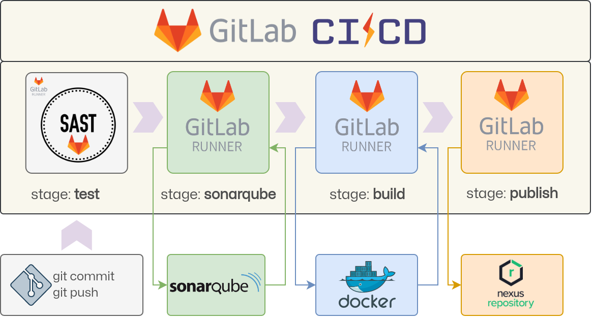

# GitLab Workshop

## Environment architecture

The overall architecture of this workshop project is described in the following
image:

Everything is meant to be created on a physical machine or a virtual one (when
using Linux and QEMU/KVM remember to enable [host-passthrough](https://qemu-project.gitlab.io/qemu/system/qemu-cpu-models.html#libvirt-guest-xml)),
that will run the main Git repository for the application and the three
Kubernetes sample clusters.

Hardware requirements for the physical machine are, *at least*, 2 CPU and 4
Gigabytes of RAM. 4 CPU and 8 Gigabytes of RAM will be ideal.

Software requirements for the main machine are essentially just the Docker
service, everything else will be covered in the various stages.

The outputs reported in the various stages were taken from a [AlmaLinux 9](https://repo.almalinux.org/almalinux/9/cloud/x86_64/images/AlmaLinux-9-GenericCloud-latest.x86_64.qcow2)
virtual machine with 4 CPUs and 8 Gigabytes of RAM.

## Workshop structure

The structure of the workshop will be based on stages:

- Stage 1: [Requirements](../../Building-Castles/DevSecOps-Pipeline-Requirements.md)
  (ignore the Minikube parts, since we're not going to cover Kubernetes).
- Stage 2: [GitLab](../../Building-Castles/DevSecOps-Pipeline-GitLab.md).
- Stage 3: [GitLab SAST](../../Building-Castles/DevSecOps-Pipeline-GitLab-SAST.md).
- Stage 4: [Sonarqube](../../Building-Castles/DevSecOps-Pipeline-SonarQube.md).
- Stage 5: [Nexus](../../Building-Castles/DevSecOps-Pipeline-Nexus.md).
- Stage 6: [Full implementation](../../Building-Castles/DevSecOps-Pipeline-Full-Implementation.md).
- Stage 7: [Issue resolution](Stage-7-Issue-Resolution.md).

## References

There are several technologies covered in this workshop, the main ones are
listed here:

- [GitLab](https://gitlab.com/) a complete DevSecOps platform to manage code.
- [Sonarqube](https://www.sonarsource.com/products/sonarqube) an on-premise
  analysis tool designed to detect coding issues
- [Nexus](https://www.sonatype.com/products/sonatype-nexus-repository) artifact
  repository manager.

## Author

Raoul Scarazzini ([raoul.scarazzini@kiratech.it](mailto:raoul.scarazzini@kiratech.it))
