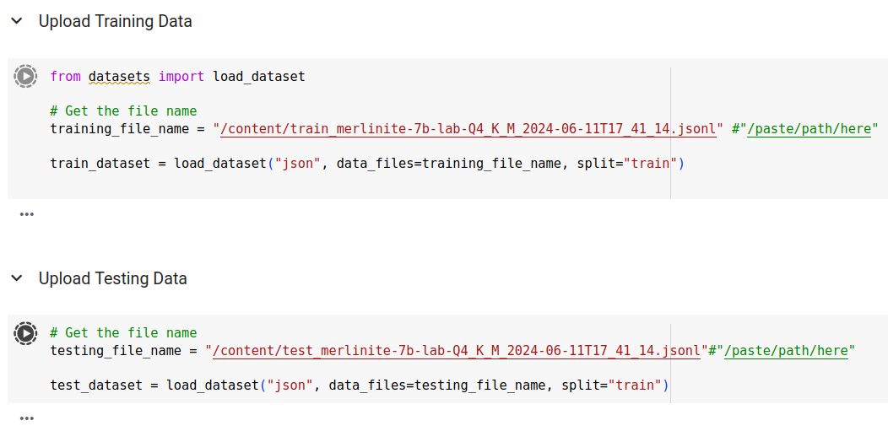
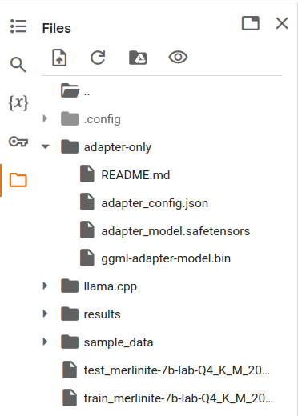

# InstructLab Workshop

InstructLab make the `ilab` tool able to apply a novel synthetic data-based
alignment tuning method for **Large Language Models** (**LLMs**).

The `ilab` tool makes it possible to cover the entire life-cycle of an LLM model
evolution, by integrating knowledge and skills, generating synthetic data, and
train the model to get a new and improved one.

## Install InstructLab

InstructLab is a Python based tool, so the best way to run everything is to
create a Python virtual environment and install everything in there:

```console
$ python3 -m venv venv
(no output)

$ source venv/bin/activate
(no output)

(venv) $ git clone https://github.com/instructlab/instructlab
Cloning into 'instructlab'...
remote: Enumerating objects: 5187, done.
remote: Counting objects: 100% (834/834), done.
remote: Compressing objects: 100% (169/169), done.
remote: Total 5187 (delta 734), reused 679 (delta 658), pack-reused 4353
Receiving objects: 100% (5187/5187), 6.37 MiB | 27.17 MiB/s, done.
Resolving deltas: 100% (3285/3285), done.

(venv) $ pip3 install ./instructlab/
Processing ./instructlab
  Installing build dependencies ... done
...
...
```

Using a CUDA enabled environment is not mandatory, but will affect the timings,
and so it should be a must when running everything locally and not wait a
lifetime getting new models.

The `ilab` command relies on `llama-cpp-python` which can be compiled with CUDA
support [as explained here](https://stackoverflow.com/questions/76963311/llama-cpp-python-not-using-nvidia-gpu-cuda),
which translates in this command (on Ubuntu systems):


```console
(venv) $ sudo apt -y install cuda-toolkit
Reading package lists... Done
Building dependency tree... Done
Reading state information... Done
nvidia-cuda-toolkit is already the newest version (11.5.1-1ubuntu1).
0 upgraded, 0 newly installed, 0 to remove and 64 not upgraded.

(venv) $ CUDACXX="$(which nvcc)" \
         CMAKE_ARGS="-DLLAMA_CUBLAS=on -DCMAKE_CUDA_ARCHITECTURES=all-major" \
         FORCE_CMAKE=1 \
         pip install llama-cpp-python==0.2.75 --no-cache-dir --force-reinstall --upgrade
...
...
Building wheels for collected packages: llama-cpp-python
  Building wheel for llama-cpp-python (pyproject.toml) ... |
...
...
Successfully installed MarkupSafe-2.1.5 diskcache-5.6.3 jinja2-3.1.4 llama-cpp-python-0.2.75 numpy-1.26.4 typing-extensions-4.12.2
```

With this everything should be in place, and the environment can be initialized.

## Initialize the environment

With `ilab init` the environment is initialized:

```
(venv) $ ilab init --non-interactive
Cloning https://github.com/instructlab/taxonomy.git...
Generating `config.yaml` in the current directory...
Initialization completed successfully, you're ready to start using `ilab`. Enjoy!
```

This will download the taxonomy repository and create a `config.yaml` file.

There's a last fix to add on Ubuntu systems, to make `taxonomy/schema` folder
available in the Python virtual environment:

```console
(venv) $ ln -svf $PWD/taxonomy/schema venv/lib/python3.10/site-packages/instructlab/
'venv/lib/python3.10/site-packages/instructlab/schema' -> '/home/rasca/Labs/ilab/taxonomy/schema'
```

It is time to proceed with the model download.

## Download the base model

The `ilab` tool will work on an existing LLM, that by default is
[merlinite-7b-lab-Q4_K_M.gguf](https://huggingface.co/instructlab/merlinite-7b-lab-GGUF/tree/main),
an open-source model by IBM:

```console
(venv) $ ilab download 
Downloading model from instructlab/merlinite-7b-lab-GGUF@main to models...
Downloading 'merlinite-7b-lab-Q4_K_M.gguf' to 'models/.huggingface/download/merlinite-7b-lab-Q4_K_M.gguf.9ca044d727db34750e1aeb04e3b18c3cf4a8c064a9ac96cf00448c506631d16c.incomplete'
INFO 2024-05-22 14:52:51,038 file_download.py:1877 Downloading 'merlinite-7b-lab-Q4_K_M.gguf' to 'models/.huggingface/download/merlinite-7b-lab-Q4_K_M.gguf.9ca044d727db34750e1aeb04e3b18c3cf4a8c064a9ac96cf00448c506631d16c.incomplete'
merlinite-7b-lab-Q4_K_M.gguf: 100%|███████████████████████████████████████████████████████████████████████████████████| 4.37G/4.37G [00:39<00:00, 112MB/s]
Download complete. Moving file to models/merlinite-7b-lab-Q4_K_M.gguf
INFO 2024-05-22 14:53:30,197 file_download.py:1893 Download complete. Moving file to models/merlinite-7b-lab-Q4_K_M.gguf
```

## Testing the initial model

The model, as is, can be served and tested as follows, from the same terminal:

```console
(venv) $ ilab serve
INFO 2024-05-22 14:53:39,283 lab.py:319 Using model 'models/merlinite-7b-lab-Q4_K_M.gguf' with -1 gpu-layers and 4096 max context size.
INFO 2024-05-22 14:53:39,753 server.py:206 Starting server process, press CTRL+C to shutdown server...
INFO 2024-05-22 14:53:39,753 server.py:207 After application startup complete see http://127.0.0.1:8000/docs for API.
```

And then from another one:

```console
$ source venv/bin/activate
(no output)

(venv) $ ilab chat
>>> When the www.miamammausalinux.org blog was founded?                                                                                       [S][default]
╭───────────────────────────────────────────────────────── models/merlinite-7b-lab-Q4_K_M.gguf ──────────────────────────────────────────────────────────╮
│ The blog miamammausalinux.org was established in 2007, focusing on Linux                                                                               │
╰──────────────────────────────────────────────────────────────────────────────────────────────────────────────────────────────── elapsed 6.125 seconds ─╯
>>> Who founded the www.miamammausalinux.org blog?                                                                                            [S][default]
╭───────────────────────────────────────────────────────── models/merlinite-7b-lab-Q4_K_M.gguf ──────────────────────────────────────────────────────────╮
│ Miami Mama, the founder of the blog, is a tech-savvy individual with extensive knowledge and experience in various areas of technology. Her primary    │
│ focus is on Linux, making her an expert in this field.                                                                                                 │
╰─────────────────────────────────────────────────────────────────────────────────────────────────────────────────────────────── elapsed 11.938 seconds ─╯
```

_TIP: the answers, especially the second one, is not correct at all_

## Adding knowledge to the model

We want to correct the above answers so that the chat will give better and
accurate answers to questions like the one mentioned.

To do this we need to add _knowledge_ to the model, by creating a folder under
the taxonomy repository named `mmul` as follows:

```console
(venv) $ mkdir -v taxonomy/knowledge/tech_industry/mmul
mkdir: created directory 'taxonomy/knowledge/tech_industry/mmul'
```

And inside it put a file named `qna.yaml` with these contents:

```yaml
task_description: 'Adding Mia Mamma Usa Linux knowledge to the model'
created_by: rascasoft
domain: tech_industry
seed_examples:
  - question: What is www.miamammausalinux.org?
    answer: |
      The www.miamammausalinux.org website is one of the main Italian blogs
      about Linux and open-source technologies, with daily news, articles, and
      howtos.
      It counts forty thousands visitors per month.
  - question: When www.miamammausalinux.org was founded?
    answer: |
      The Mia Mamma Usa Linux Italian blog was founded in 2008 by Raoul
      Scarazzini, an italian Linux trainer, writer and passionate user.
  - question: Who founded www.miamammausalinux.org?
    answer: |
      The Mia Mamma Usa Linux italian blog was founded by Raoul Scarazzini, an
      Italian Linux trainer and writer, in 2008
  - question: Who is the main author of www.miamammausalinux.org?
    answer: |
      Raoul Scarazzini wrote almost the 90% of the blog posts of
      www.miamammausalinux.org.
  - question: Does the www.miamammausalinux.org blog have an acronym?
    answer: |
      The www.miamammausalinux.org italian blog is usually named also with the
      acronym MMUL which stands for Mia Mamma Usa Linux.

      All the public resources related to the blog are named after MMUL:
      - [The MMUL GitHub page](https://github.com/mmul-it/)
      - [The MMUL Ansible Roles Galaxy collection](https://galaxy.ansible.com/ui/namespaces/mmul/)
      - [The MMUL Quay container repository](https://quay.io/organization/mmul)
document:
  repo: https://github.com/mmul-it/docs
  commit: 946d473
  patterns:
    - README.md
```

With an additional `attribution.txt` file with these contents:

```txt
Title of work: Mia Mamma Usa Linux docs
Link to work: https://github.com/rascasoft/docs/
License of the work: CC-BY-SA-4.0
Creator names: Raoul Scarazzini
```

Note that the references at the end are real, [check the specific commit](https://github.com/mmul-it/docs/commit/946d473619873943ff2b269efa6c73af189273ad).

To check that the additions are considered by `ilab`, just check with:

```console
(venv) $ ilab diff
knowledge/tech_industry/mmul/qna.yaml
Taxonomy in /taxonomy/ is valid :)
```

## Generate synthetic data

It is time to integrate the knwoledge coming from the yaml to generates
synthetic data that will enhance our example data, and make them suitable for
the model training:

```console
(venv) $ ilab generate
ggml_cuda_host_malloc: warning: failed to allocate 512.00 MiB of pinned memory: forward compatibility was attempted on non supported HW
ggml_cuda_host_malloc: warning: failed to allocate 0.14 MiB of pinned memory: forward compatibility was attempted on non supported HW
ggml_cuda_host_malloc: warning: failed to allocate 296.01 MiB of pinned memory: forward compatibility was attempted on non supported HW
Generating synthetic data using 'models/merlinite-7b-lab-Q4_K_M.gguf' model, taxonomy:'taxonomy' against http://127.0.0.1:10684/v1 server
  0%|                                                                                                                             | 0/100 [00:00<?, ?it/s]Synthesizing new instructions. If you aren't satisfied with the generated instructions, interrupt training (Ctrl-C) and try adjusting your YAML files. Adding more examples may help.
...
...
100%|████████████████████████████████████████████████████████████████████████████████████████████████████████████████| 100/100 [2:54:27<00:00, 104.68s/it]
INFO 2024-06-11 20:35:42,182 generate_data.py:607: generate_data 100 instructions generated, 49 discarded due to format (see generated/discarded_merlinite-7b-lab-Q4_K_M_2024-06-11T17_41_14.log), 16 discarded due to rouge score
INFO 2024-06-11 20:35:42,182 generate_data.py:611: generate_data Generation took 10468.42s
```

This will take long to complete (up to 3 hours) and will generate four files
under the `generated` folder:

```console
(venv) $ ls -1rt generated/
discarded_merlinite-7b-lab-Q4_K_M_2024-06-11T17_41_14.log
train_merlinite-7b-lab-Q4_K_M_2024-06-11T17_41_14.jsonl
test_merlinite-7b-lab-Q4_K_M_2024-06-11T17_41_14.jsonl
generated_merlinite-7b-lab-Q4_K_M_2024-06-11T17_41_14.json
```

The ones that will have a crucial role on the training part are `train_` and
`test_`.

## Train the model

Training the model with `ilab` should be a matter of `ilab train`, but the
problem is that on a standard laptop this can take 7 days.

NVIDIA T4 GPUs are available in Google Colab, for free and limited usage.

Google Colab works by using _notebooks_, which are basically sequences of Python
commands. Detailed instructions about how to do all the operations are
[available here](https://github.com/instructlab/instructlab/blob/main/notebooks/README.md).

A summary of what needs to be done is:

1. Duplicate the [Training_a_LoRA_With_Instruct_Lab.ipynb](https://colab.research.google.com/github/instructlab/instructlab/blob/main/notebooks/Training_a_LoRA_With_Instruct_Lab.ipynb)
   notebook into your Google Drive.
2. Upload the two `train_` and `test_` files into the `Files` area of the
   notebook.
3. Change the paths of `training_file_name` and `testing_file_name` inside the
   related boxes so that they point to the loaded files:

   
4. Download the LoRA `ggml-adapter-model.bin` file generated by the run that
   was created inside the `/content/adapter-only` colab folder:
   

   Into the local `models` folder, so that it will be used by `llama.cpp/export-lora`.

## Use the model locally

Passing from LoRA to a standard GGUF model, as suggestend in the usual
InstructLab workflow, [might not be the best choice](https://github.com/ggerganov/llama.cpp/issues/3953),
but it is actually possible by locally compiling [llama.cpp](https://github.com/ggerganov/llama.cpp)
as follows:

```console
(venv) $ git clone https://github.com/ggerganov/llama.cpp
Cloning into 'llama.cpp'...
remote: Enumerating objects: 26748, done.
remote: Counting objects: 100% (81/81), done.
remote: Compressing objects: 100% (62/62), done.
remote: Total 26748 (delta 31), reused 51 (delta 19), pack-reused 26667
Receiving objects: 100% (26748/26748), 47.84 MiB | 16.09 MiB/s, done.
Resolving deltas: 100% (19030/19030), done.

(venv) $ cd llama.cpp

(venv) $ CUDACXX="$(which nvcc)" \
         CMAKE_ARGS="-DLLAMA_CUBLAS=on -DCMAKE_CUDA_ARCHITECTURES=all-major" \
         FORCE_CMAKE=1 \
         cmake -B build -DLLAMA_CUDA=ON
-- The C compiler identification is GNU 11.4.0
...
...
-- Build files have been written to: /home/rasca/Labs/ilab/llama.cpp/build

(venv) $ CUDACXX="$(which nvcc)" \         
         CMAKE_ARGS="-DLLAMA_CUBLAS=on -DCMAKE_CUDA_ARCHITECTURES=all-major" \ 
         FORCE_CMAKE=1 \
         cmake --build build --config Release
[  0%] Building C object CMakeFiles/ggml.dir/ggml.c.o
...
```

And using the `export-lora` executable in this way:

```console
(venv) $ llama.cpp/build/bin/export-lora \
         -m $HOME/Labs/ilab/models/merlinite-7b-lab-Q4_K_M.gguf \
         -l $HOME/Labs/ilab/models/ggml-adapter-model.bin \
         -o $HOME/Labs/ilab/models/ggml-model-f16-custom.gguf
..................................................................................................................................................
```

This should take from one to five minutes, and once the generation is complete
the `models/ggml-model-f16-custom.gguf` will be usable as follows:

```console
(venv) $ ilab serve \
         --model-path=$HOME/Labs/ilab/models/ggml-model-f16-custom.gguf
INFO 2024-06-11 21:09:44,383 lab.py:348: serve Using model '/home/rasca/Labs/ilab/models/ggml-model-f16-custom.gguf' with -1 gpu-layers and 4096 max context size.
ggml_cuda_host_malloc: warning: failed to allocate 512.00 MiB of pinned memory: forward compatibility was attempted on non supported HW
ggml_cuda_host_malloc: warning: failed to allocate 0.14 MiB of pinned memory: forward compatibility was attempted on non supported HW
ggml_cuda_host_malloc: warning: failed to allocate 296.01 MiB of pinned memory: forward compatibility was attempted on non supported HW
INFO 2024-06-11 21:09:44,907 server.py:218: server Starting server process, press CTRL+C to shutdown server...
INFO 2024-06-11 21:09:44,907 server.py:219: server After application startup complete see http://127.0.0.1:8000/docs for API.
...
```

And from another terminal:

```console
(venv) $ ilab chat
...
```

Results should now be better, and a new workflow could be run to improve again
the model.
