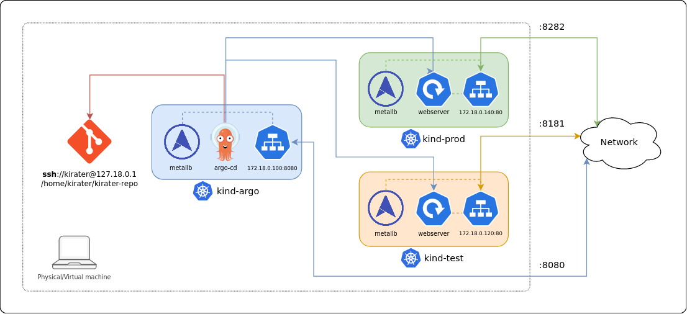

# Argo CD Workshop

## Environment architecture

The overall architecture of this workshop project is described in the following
image:

Everything is meant to be created on a physical machine or a virtual one (when using Linux and QEMU/KVM remember to enable [host-passthrough](https://qemu-project.gitlab.io/qemu/system/qemu-cpu-models.html#libvirt-guest-xml)), that will run the main Git repository for the application and the three Kubernetes sample clusters.

Hardware requirements for the physical machine are, *at least*, 4 CPU and 8 Gigabytes of RAM. 8 CPU and 16 Gigabytes of RAM will be ideal.

Software requirements for the main machine are essentially just the Docker service, everything else will be covered in the various stages.

## Workshop structure

The structure of the workshop will be based on stages:

- Stage 1: [Kubernetes clusters installation](Stage-1-K8S-Installation.md).
- Stage 2: [MetalLB installation and configuration](Stage-2-MetalLB-Installation.md).
- Stage 3: [Argo-CD installation and configuration](Stage-3-Argo-CD-Installation.md).
- Stage 4: [Argo-CD application tests](Stage-4-Argo-CD-Application-Test.md).

## References

There are several technologies covered in this workshop, the main ones are listed here:

- [Kubernetes](https://kubernetes.io/) also known as K8s, is an open-source system for automating deployment, scaling, and management of containerized applications.
- [Kind](https://kind.sigs.k8s.io/) a tool for running local Kubernetes clusters using Docker container "nodes".
- [MetalLB](https://metallb.universe.tf/) a bare metal load balancer for Kubernetes.
- [Argo CD](https://argo-cd.readthedocs.io/) a declarative GitOps CD for Kubernetes.

## Author

Raoul Scarazzini ([raoul.scarazzini@kiratech.it](mailto:raoul.scarazzini@kiratech.it))
